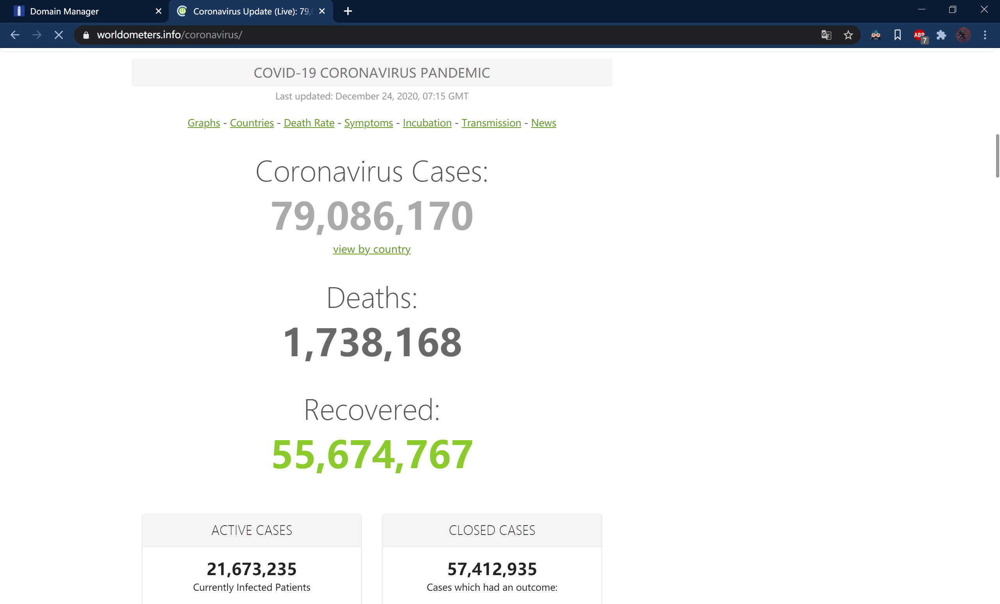
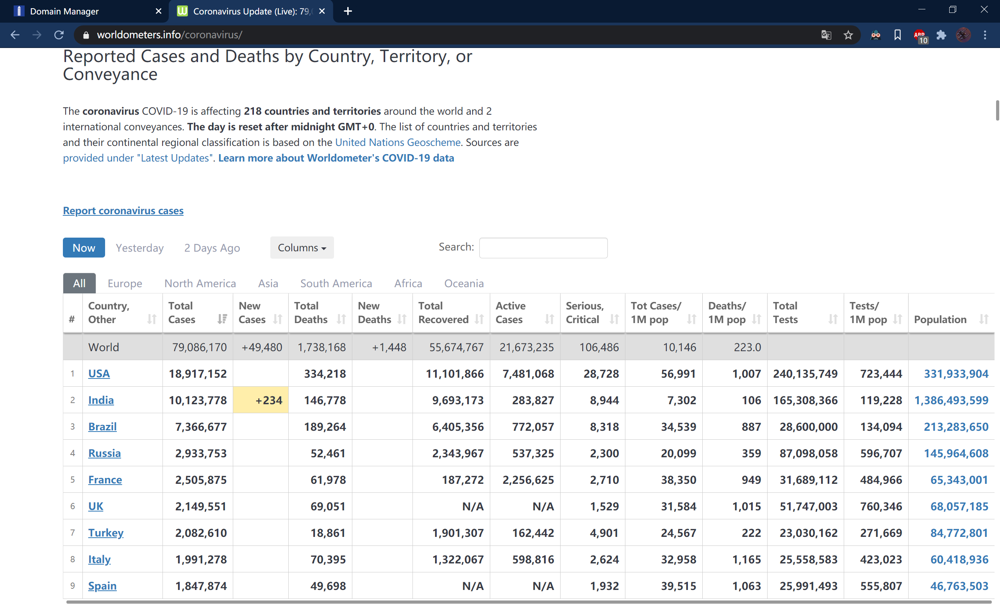
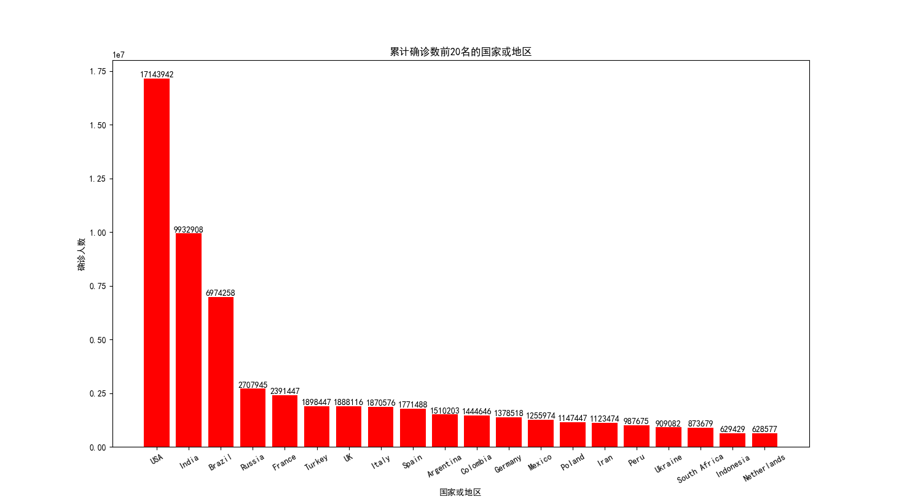
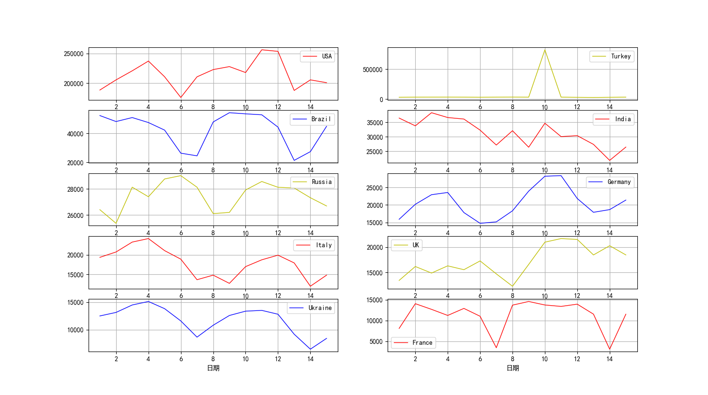
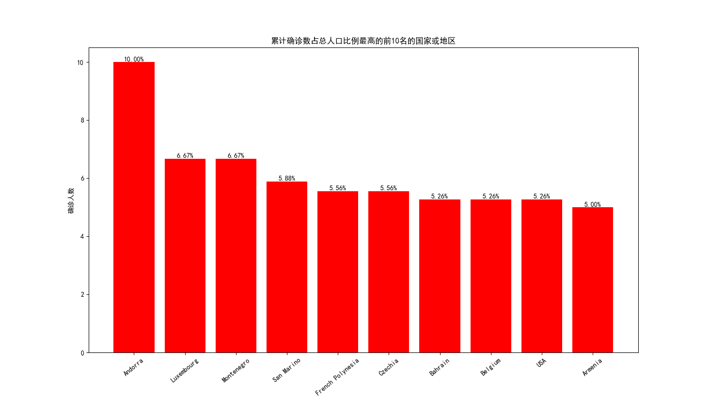
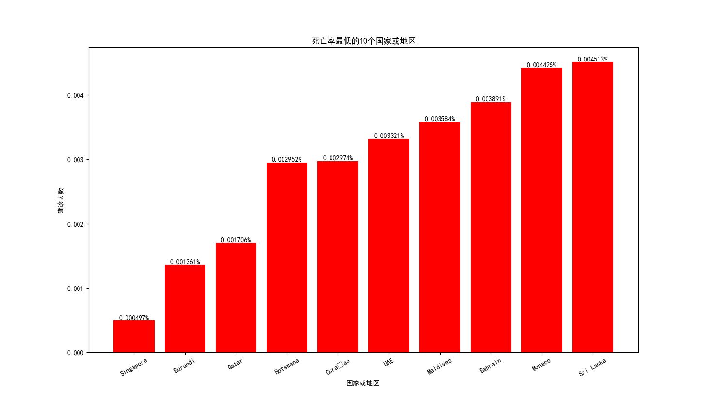
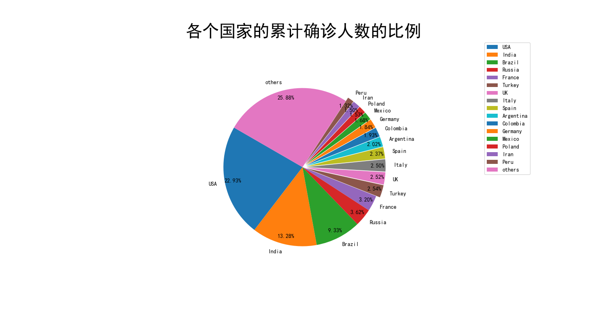
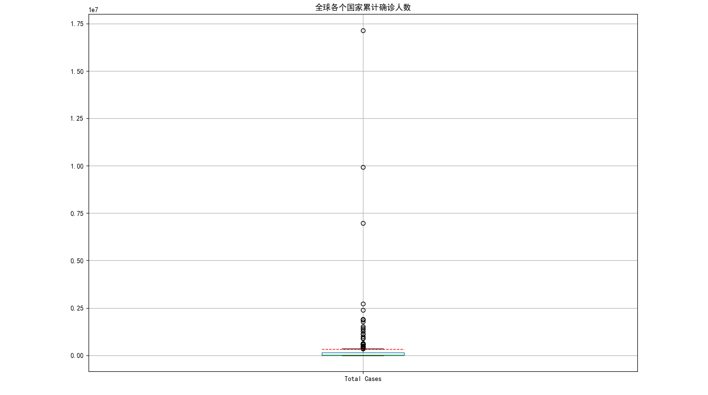
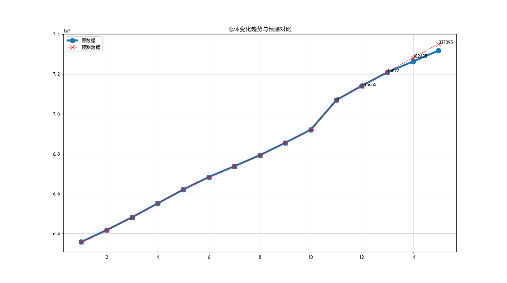
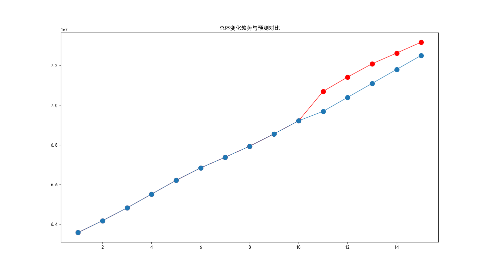

# 期末作业

姓名：路修远 学号：2018211148 班级：2018211303

[TOC]

# 实验要求

找一个有全球新冠病毒数据的网站，爬取其中的数据（禁止使用数据接口直接获取数据）。 要求爬取从 2020 年 12 月 1 日开始的连续 15 天的数据，国家数不少于 100 个。

- 数据来源

> https://www.worldometers.info/coronavirus/#nav-yesterday

- 首页





# 数据处理以及展示

## 爬虫

实际操作中使用`crontab`命令设置每天下载页面为html文件，以下是使用python写的爬虫程序

- spider.py
```python
import requests

url = 'https://www.worldometers.info/coronavirus/#nav-yesterday'
with open('file.html','w',encoding='utf-8') as f:
	x = requests.get(url)
	f.write(x.text)
```
- run.sh
```shell
#!/usr/bin/sh
time=$(date "+%Y%m%d-%H%M%S")
wget -O /home/python_repo/data/${time}.html https://www.worldometers.info/coronavirus/#nav-yesterday
```
## 数据处理

```python
import requests
from lxml import etree
import csv
import os


# 处理数据
def process(filename: str):
    df = pd.read_csv(filename, encoding='utf-8', dtype=str) # 读入csv文件
    df = df.replace("['']", "") # 替换空
    print(df.describe())
    print(df.info())
    print(df.isnull().sum())
    df.to_csv(r'/home/python_repo/data/'+filename[:-4]+'.csv',
              encoding='utf-8', index=None)


# 加载html文件，参数为文件路径，返回一个DOM的文件对象
def loadhtml(filename: str):
    with open(filename, 'r', encoding='utf-8') as f:
        lines = f.readlines()
        return etree.HTML(''.join(lines))
    return None


# 解析html对象，返回表的header和body
def parse(html):
    root = html.xpath('//div[@id="nav-yesterday"]')[0]  # 记录数据的表格所在
    header = []
    body = []

    # fill in the header
    th = root.xpath('div/table/thead/tr/th')
    for ele in th:
        text = ele.xpath('text() | */text()')
        header.append(' '.join(text))

    # fill in the body
    tr = root.xpath('div/table/tbody[1]/tr')
    for ele in tr:
        td = ele.xpath('td')
        lz = []
        for tdata in td:
            data = tdata.xpath('*/text() | text()')
            if len(data) < 1:  # 如果没有数据
                lz.append([''])
            else:
                data_row = []  # 新建一个数据row
                for i in data:
                    data_row.append(i.strip())
                lz.append(''.join(data_row))
        body.append(lz)
    return header, body


def main():
    url = '/home/python_repo/data'          # 摆放html文件的目录
    lz = os.listdir(url)                    # 生成所有文件的列表
    for file in lz:
        if file[-4:] != 'html':             # 挑出所有的html文件
            continue
        html = loadhtml(url + '/' + file)   # 加载文件
        header, body = parse(html)          # 解析html文件，生成数据
        filename = file
        # 向同名csv文件中写入数据
        with open(filename[1:-4]+'csv', 'w', encoding='utf-8', newline='') as f:
            writer = csv.writer(f)
            writer.writerow(header)
            writer.writerows(body)
        process(filename)                # 处理数据


if __name__ == '__main__':
    main()

```

## 15 天中，全球新冠疫情的总体变化趋势

```python
import matplotlib.pyplot as plt
import numpy as np
import final


def main():
    dfs = final.loadData() # 加载数据为dataframe对象
    plt.rcParams['font.sans-serif'] = ['SimHei'] # 中文支持
    fig, ax = plt.subplots()
    datelz, totlist = final.worldtrend(dfs)
    ax.set_title('全球新冠疫情总体变化趋势')
    x = np.arange(16) + 1
    print(totlist)
    plt.plot(x, totlist, linewidth=2, linestyle="-", color='r',marker='o', label='总人数')
    plt.xticks(x,datelz,rotation=30,fontsize='small')
    for a, b in zip(x, totlist): 
        plt.text(a, b+5, '%d' % b, ha='center', va='bottom', fontsize=12)
    ax.set_xlabel('日期')
    ax.set_ylabel('确诊人数')
    plt.legend()
    plt.show()


if __name__ == '__main__':
    main()

```

 

## 累计确诊数排名前 20 的国家名称及其数量

```python
import matplotlib.pyplot as plt
import numpy as np
import final


def main():
    dfs = final.loadData() # 加载数据为dataframe对象
    plt.rcParams['font.sans-serif'] = ['SimHei'] # 中文支持
    fig, ax = plt.subplots()
    loclz, datalz = final.top20(dfs)
    ax.set_title('累计确诊数前20名的国家或地区')
    x = np.arange(20) + 1
    plt.bar(x, datalz, color='r')
    plt.xticks(x,loclz, rotation=30, fontsize='medium')
    ax.set_xlabel('国家或地区')
    ax.set_ylabel('确诊人数')
    for a, b in zip(x, datalz):  # 在直方图上显示数字
        plt.text(a, b, '%d' % b, ha='center', va='bottom', fontsize=10)
    plt.show()


if __name__ == '__main__':
    main()

```



## 15 天中，每日新增确诊数累计排名前 10 个国家的每日新增确诊数据的曲线图

```python
import matplotlib.pyplot as plt
import numpy as np
import final


colors = ['r', 'y', 'b']


def main():
    dfs = final.loadData() # 加载数据为dataframe对象
    fig, ax = plt.subplots(nrows=5, ncols=2)
    plt.rcParams['font.sans-serif'] = ['SimHei'] # 中文支持
    dic = final.newcase_top10(dfs)
    datelz = np.arange(15) + 1
    keylz = dic.keys()
    for i, key in zip(range(0, 10), keylz):
        r = i // 2
        c = i % 2
        # ax[r][c].set_title(key)
        ax[r][c].set_xlabel('日期', fontsize='medium')
        ax[r][c].grid()
        # ax[r][c].set_xticklabels(
        #     [i for i in range(1201, 1216)], rotation=30, fontsize='small')
        ax[r][c].plot(datelz, dic[key], linewidth=1, linestyle="-", label=key, color=colors[i%3])
        ax[r][c].legend(loc='best')
    plt.show()


if __name__ == '__main__':
    main()

```



## 累计确诊人数占国家总人口比例最高的 10 个国家

```python
import matplotlib.pyplot as plt
import numpy as np
import final


def main():
    dfs = final.loadData() # 加载数据为dataframe对象
    plt.rcParams['font.sans-serif'] = ['SimHei'] # 中文支持
    fig, ax = plt.subplots()
    loclz, datalz = final.caseperppl(dfs)
    datalz = np.array(datalz)
    datalz = 100/datalz
    ax.set_title('累计确诊数占总人口比例最高的前10名的国家或地区')
    x = np.arange(10) + 1
    plt.bar(x, datalz, color='r')
    plt.xticks(x,loclz, rotation=40, fontsize='medium')
    ax.set_xlabel('国家或地区')
    ax.set_ylabel('确诊人数')
    for a, b in zip(x, datalz):  # 在直方图上显示数字
        plt.text(a, b, '%.2f' % b + '%', ha='center', va='bottom', fontsize=10)
    plt.show()


if __name__ == '__main__':
    main()

```



## 死亡率（累计死亡人数/累计确诊人数）最低的 10 个国家

```python
import matplotlib.pyplot as plt
import matplotlib
import numpy as np
import final


def main():
    # matplotlib.rc('font', family='Arial')
    dfs = final.loadData() # 加载数据为dataframe对象
    plt.rcParams['font.sans-serif'] = ['SimHei'] # 中文支持
    fig, ax = plt.subplots()
    loclz, datalz = final.lowest_death(dfs)
    datalz = np.array(datalz)
    # datalz = 100/datalz
    print(datalz)
    ax.set_title('死亡率最低的10个国家或地区')
    x = np.arange(10) + 1
    plt.bar(x, datalz, color='r')
    plt.xticks(x,loclz, rotation=30, fontsize='medium')
    ax.set_xlabel('国家或地区')
    ax.set_ylabel('确诊人数')
    for a, b in zip(x, datalz):  # 在直方图上显示数字
        plt.text(a, b, '%.6f' % b + '%', ha='center', va='bottom', fontsize=10)
    plt.show()


if __name__ == '__main__':
    main()

```



##  用饼图展示各个国家的累计确诊人数的比例（数据较小的国家 可以合并处理）

```python
import matplotlib.pyplot as plt
import numpy as np
import final


def main():
    plt.figure(figsize=(6, 9))  # 调节图形大小
    plt.rcParams['font.sans-serif'] = ['SimHei'] # 中文支持
    dfs = final.loadData() # 加载数据为dataframe对象
    loclz, datalz = final.totcase(dfs)  # 返回国家列表和数据列表
    data = np.array(datalz)
    sum = data.sum()
    percent = data/sum

    pos = 15  # 截断位置
    other = 0

    for x in datalz[pos:]:
        other += x

    explode = [0] * 5 + [0.05] * 11 + [0]
    x = datalz[:pos+1]
    x = np.append(x, other)
    label = loclz[:pos+1]
    label = np.append(label, 'others')
    patches = plt.pie(x, labels=label, explode=explode, autopct='%3.2f%%',
                      pctdistance=0.9, startangle=150)

    plt.title('各个国家的累计确诊人数的比例', fontsize=30)
    plt.axis('equal')
    plt.legend(label, loc='best')
    plt.show()


if __name__ == '__main__':
    main()

```



## 展示全球各个国家累计确诊人数的箱型图

```python
import matplotlib.pyplot as plt
import numpy as np
import final


def main():
	dfs = final.loadData() # 加载数据为dataframe对象
    plt.rcParams['font.sans-serif'] = ['SimHei'] # 中文支持
    df = dfs['20201216']
    df = df[df['#'].notna()]
    f = df.boxplot(column=['Total Cases'],meanline=True,showmeans=True,vert=True,return_type='dict')
    plt.text(1.1,df['Total Cases'].mean(),"%.2f" % df['Total Cases'].mean())
    for mean in f['means']:
        mean.set(color='r', linewidth=1)
    plt.title('全球各个国家累计确诊人数')
    plt.show()


if __name__ == '__main__':
    main()

```



## 其它你希望分析和展示的数据

```python
from pyecharts import options as opts
from pyecharts.charts import Map
from pyecharts.render import make_snapshot
from snapshot_phantomjs import snapshot
import numpy as np
import final


def data():
    dfs = final.loadData()
    key = '20201216'
    df = dfs[key]
    df = df[df['#'].notna()]

    x,y = df['Country, Other'].values, df['Total Cases'].values
    lz = []

    for i,j in zip(x,y):
        if i == 'USA':
            i = 'United States'
        lz.append([i,j.item()])
    
    lz.sort(key=lambda x:-x[1])
    return lz


def map_visualmap() -> Map:
    c = (
        Map()
        .add("全球疫情分布图", [z for z in data()], "world")
        .set_global_opts(
            title_opts=opts.TitleOpts(title="疫情"),
            visualmap_opts=opts.VisualMapOpts(min_=0,max_=2000000))
        .set_series_opts(label_opts=opts.LabelOpts(is_show=False))
    )
    return c

make_snapshot(snapshot, map_visualmap().render(), "map1.png")
map_visualmap().render("map"+".html")


print("done")
```

<div align='middle'>全球疫情分布图</div>


[点击查看网页版](http://lxythan2lxy.cn/python/map.html)

# 数据分析

## 根据以上数据，列出全世界应对新冠疫情最好的 10 个国家，并说明你的理由


## 针对全球累计确诊数，利用前 10 天采集到的数据做后 5 天的预测，并与实际数据进行 对比。说明你预测的方法，并分析与实际数据的差距和原因

