# 新冠疫情数据分析

姓名：马嘉骥	学号：2018211149	班级：2018211303

[TOC]

## 题目要求

找一个有全球新冠病毒数据的网站，爬取其中的数据（禁止使用数据接口直接获取数据）。 要求爬取从 2020 年 12 月 1 日开始的连续 15 天的数据，国家数不少于 100 个。 

1. 标明你的数据来源：包括网址和首页截图 
2. 数据分析和展示应包括： a) 15 天中，全球新冠疫情的总体变化趋势； b) 累计确诊数排名前 20 的国家名称及其数量； c) 15 天中，每日新增确诊数累计排名前 10 个国家的每日新增确诊数据的曲线图； d) 累计确诊人数占国家总人口比例最高的 10 个国家； e) 死亡率（累计死亡人数/累计确诊人数）最低的 10 个国家； f) 用饼图展示各个国家的累计确诊人数的比例（你爬取的所有国家，数据较小的国家 可以合并处理）； g) 展示全球各个国家累计确诊人数的箱型图，要有平均值 h) 其它你希望分析和展示的数据。 以上图形应包括完整的坐标、刻度、标签、图例等，如有必要请配上说明文字，对 图中的内容进行解释。 
3. 根据以上数据，列出全世界应对新冠疫情最好的 10 个国家，并说明你的理由。
4. 针对全球累计确诊数，利用前 10 天采集到的数据做后 5 天的预测，并与实际数据进行 对比。说明你预测的方法，并分析与实际数据的差距和原因。
5. 请贴上爬虫程序的核心代码、数据处理及数据展示的核心代码（应有足够的注释）；

## 数据来源

https://www.worldometers.info/coronavirus/


## 爬虫代码

```python
import requests
from lxml import etree


def spider():
    url = "https://www.worldometers.info/coronavirus/#nav-yesterday"
    with open('covid.html', 'w', encoding='utf-8') as f:
        x = requests.get(url)
        f.write(x.text)
```


## 爬取数据

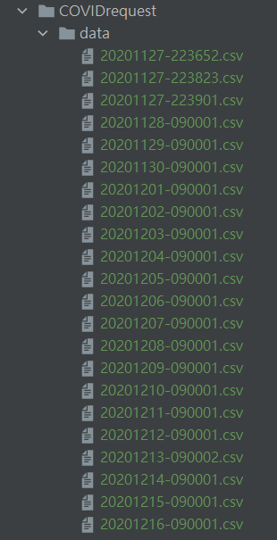


## 数据处理代码

```python
import csv
import os

import pandas as pd
from lxml import etree


def syntax(filename: str):
    df = pd.read_csv(filename, encoding='utf-8', dtype=str)
    df = df.replace("['']", "")  # 格式化
    print(df.describe())
    print(df.info)
    print(df.isnull().sum)
    df.to_csv(r'/data/' + filename[:-4] + '.csv', encoding='utf-8', index=None)


def transHTML(filename: str):
    with open(filename, 'r', encoding='utf-8') as f:
        lines = f.readlines()
        return etree.HTML(''.join(lines))


def parser(html):
    # Yesterday data
    root = html.xpath('//div[@id="nav-yesterday"]')[0]

    header = []
    th = root.xpath('div/table/thead/tr/th')  # 处理表格头部
    for item in th:
        text = item.xpath('text()|*/text()')
        header.append(''.join(text))

    body = []
    tr = root.xpath('div/table/tbody[1]/tr')
    for item in tr:
        td = item.xpath('td')
        lz = []
        for i in td:
            data = i.xpath('*/text()|text()')
            if len(data) < 1:
                lz.append([''])
            else:
                data_row = []
                for i in data:
                    data_row.append(i.strip())
                lz.append(''.join(data_row))
        body.append(lz)
    return header, body


def main():
    addr = '/data/'
    lz = os.listdir(addr)
    for file in lz:
        if file[-4:] != 'html':
            continue
        html = transHTML(addr + '/' + file)
        header, body = parser(html)
        filename = file
        with open(filename[1:-4] + 'csv', 'w', encoding='utf-8', newline='') as f:
            writer = csv.writer(f)
            writer.writerow(header)
            writer.writerows(body)
        syntax(filename)


if __name__ == '__main__':
    main()
```

## 数据分析结果

## 15 天中，全球新冠疫情的总体变化趋势

```python
import os

import matplotlib.pyplot as plt
import numpy as np
import pandas as pd


def loadfile(path=r'G:/Courseware/Python/ScrapyTest/COVIDrequest/data15') -> dict:
    dataframes = {}
    filelz = os.listdir(path)
    for filename in filelz:
        df = pd.read_csv(path + '/' + filename, thousands=',')
        df = df.sort_values(by='Country, Other', ascending=False)
        df = df.reset_index()
        dataframes[filename.partition('.')[0]] = df
    return dataframes


def worldtrend(datadict: dict):
    datelz = []
    totlist = []
    for date in datadict:
        df = datadict[date]
        worldtot = df[df['Country, Other'] == 'World']['Total Cases'].values[0]

        totlist.append(worldtot)
        datelz.append(date[-4:])
    return datelz, totlist


def main():
    dfs = loadfile()
    fig, ax = plt.subplots()
    datelz, totlist = worldtrend(dfs)
    ax.set_title('World Trend')
    x = np.arange(16) + 1
    print(totlist)
    plt.plot(x, totlist, linewidth=2, linestyle="-", marker='o')
    plt.xticks(x, datelz, rotation=30, fontsize='small')
    for a, b in zip(x, totlist):
        plt.text(a, b + 5, '%d' % b, ha='center', va='bottom', fontsize=12)
    ax.set_xlabel('Date')
    ax.set_ylabel('Cases')
    plt.legend()
    plt.show()


if __name__ == '__main__':
    main()
```

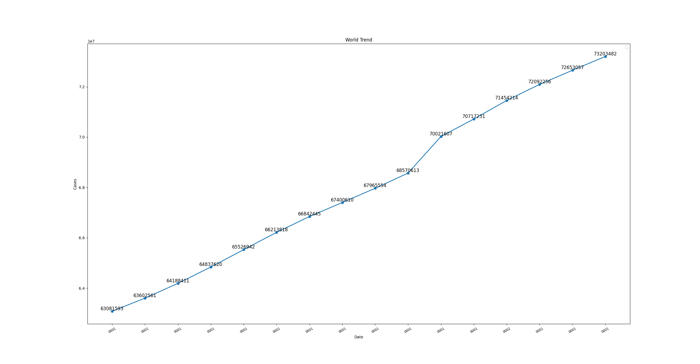

## 累计确诊数排名前 20 的国家名称及其数量

```python
import matplotlib.pyplot as plt
import numpy as np
import pandas as pd


def main():
    d15_addr = 'G:/Courseware/Python/ScrapyTest/COVIDrequest/data/20201215-090001.csv'
    d15 = pd.read_csv(d15_addr)
    d15['Total Cases'] = d15['Total Cases'].str.replace(',', '').astype(int)
    d15 = d15[d15['#'].notna()]
    d15 = d15.sort_values(by='Total Cases', axis=0, ascending=[False])
    loc = d15['Country, Other'][0:20]
    data = pd.to_numeric(d15['Total Cases'][0:20])
    fig, ax = plt.subplots()
    x = np.arange(20) + 1
    plt.bar(x, data)
    plt.xticks(x, loc, rotation=45)
    ax.set_xlabel('Country/Region')
    ax.set_ylabel('Cases')
    for a, b in zip(x, data):
        plt.text(a, b + 1, '%d' % b, ha='center', va='bottom', fontsize=10)
    plt.show()


main()
```

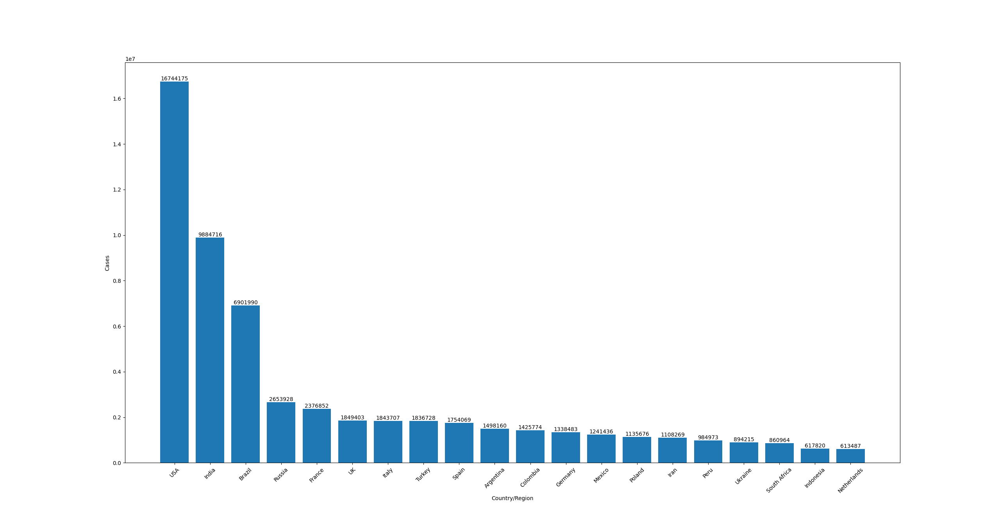

## 15 天中，每日新增确诊数累计排名前 10 个国家的每日新增确诊数据的曲线图

```python
import os

import matplotlib.pyplot as plt
import numpy as np
import pandas as pd


def loadfile(path=r'G:/Courseware/Python/ScrapyTest/COVIDrequest/data15') -> dict:
    dataframes = {}
    filelz = os.listdir(path)
    for filename in filelz:
        df = pd.read_csv(path + '/' + filename, thousands=',')
        df = df.sort_values(by='Country, Other', ascending=False)
        df = df.reset_index()
        dataframes[filename.partition('.')[0]] = df
    return dataframes


def getdata(datadict: dict):
    head = '20201201-090001'
    tail = '20201216-090001'
    df = datadict[head]
    df = df[df['#'].notna()]
    df = df.sort_values(by='Country, Other', ascending=False)
    dfhead = df[['Country, Other', 'Total Cases']]

    df = datadict[tail]
    df = df[df['#'].notna()]
    df = df.sort_values(by='Country, Other', ascending=False)
    dftail = df[['Country, Other', 'Total Cases']]

    dftail['Increment'] = dftail['Total Cases'] - dfhead['Total Cases']

    df = dftail[['Country, Other', 'Increment']]
    df = df.sort_values(by='Increment', ascending=False)
    df = df.head(10)

    ret_dict = {}
    # 遍历top10的国家
    for Country in df['Country, Other'].values:
        addlz = []
        lz = []
        for key in datadict:
            df = datadict[key]
            df = df[df['Country, Other'] == Country]
            lz.append(df['Total Cases'].values[0])
            # addlz.append(df['New Cases'].values[0])
        for i in range(1, len(lz)):
            addlz.append(lz[i] - lz[i - 1])
        ret_dict[Country] = addlz

    print(ret_dict)
    return ret_dict


def main():
    dfs = loadfile()
    fig, ax = plt.subplots(nrows=5, ncols=2)
    dic = getdata(dfs)
    datelz = np.arange(15) + 1
    keylz = dic.keys()
    for i, key in zip(range(0, 10), keylz):
        r = i // 2
        c = i % 2
        ax[r][c].set_xlabel('Date', fontsize='medium')
        ax[r][c].grid()
        ax[r][c].plot(datelz, dic[key], linewidth=1, linestyle="-", label=key)
        ax[r][c].legend(loc='best')
    plt.show()


main()
```

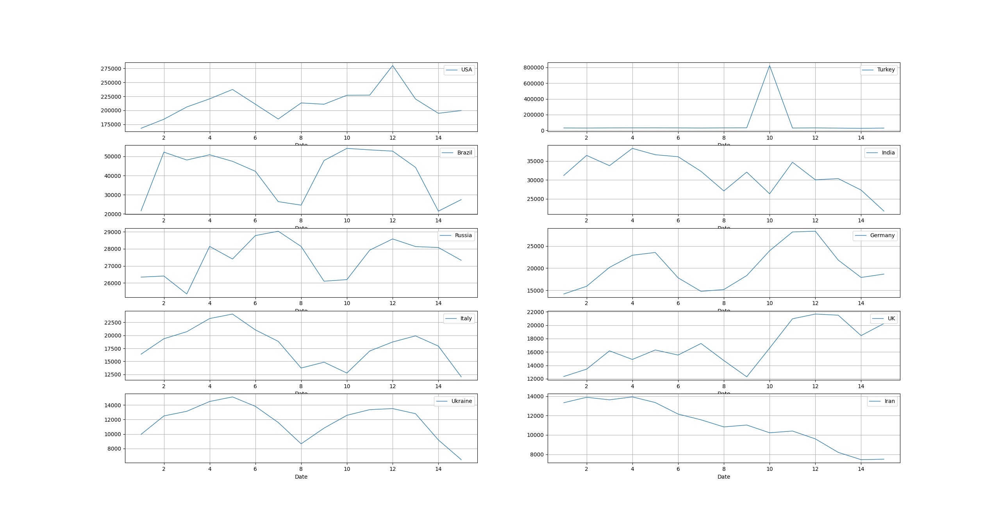

## 累计确诊人数占国家总人口比例最高的 10 个国家

```python
import os

import matplotlib.pyplot as plt
import numpy as np
import pandas as pd


def loadfile(path=r'G:/Courseware/Python/ScrapyTest/COVIDrequest/data15') -> dict:
    dataframes = {}
    filelz = os.listdir(path)
    for filename in filelz:
        df = pd.read_csv(path + '/' + filename, thousands=',')
        df = df.sort_values(by='Country, Other', ascending=False)
        df = df.reset_index()
        dataframes[filename.partition('.')[0]] = df
    return dataframes


def casePPL(datadict: dict):
    key = '20201216-090001'
    df = datadict[key]
    df = df.sort_values(by='1 Case every X ppl', ascending=True)
    df = df.head(10)

    return df['Country, Other'].values, df['1 Case every X ppl'].values


def main():
    dfs = loadfile()
    fig, ax = plt.subplots()
    loclz, datalz = casePPL(dfs)
    datalz = np.array(datalz)
    datalz = 100 / datalz
    ax.set_title('Top 10 Case/Population')
    x = np.arange(10) + 1
    plt.bar(x, datalz)
    plt.xticks(x, loclz, rotation=40, fontsize='medium')
    ax.set_xlabel('Country/Region')
    ax.set_ylabel('Cases')
    for a, b in zip(x, datalz):
        plt.text(a, b, '%.2f' % b + '%', ha='center', va='bottom', fontsize=10)
    plt.show()


if __name__ == '__main__':
    main()
```

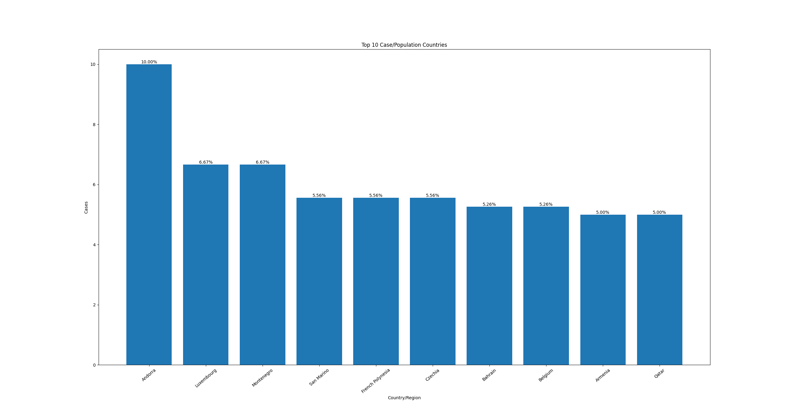

## 死亡率（累计死亡人数/累计确诊人数）最低的 10 个国家

```python
import os

import matplotlib.pyplot as plt
import numpy as np
import pandas as pd


def loadfile(path=r'G:/Courseware/Python/ScrapyTest/COVIDrequest/data15') -> dict:
    dataframes = {}
    filelz = os.listdir(path)
    for filename in filelz:
        df = pd.read_csv(path + '/' + filename, thousands=',')
        df = df.sort_values(by='Country, Other', ascending=False)
        df = df.reset_index()
        dataframes[filename.partition('.')[0]] = df
    return dataframes


def lowdeath(datadict: dict):
    key = '20201216-090001'
    df = datadict[key]
    df = df[df['#'].notna()]
    df['death_rate'] = df['Total Deaths'] / df['Total Cases']
    df = df.sort_values(by='death_rate', ascending=True)
    df = df.head(10)
    return df['Country, Other'].values, df['death_rate'].values


def main():
    dfs = loadfile()
    fig, ax = plt.subplots()
    loclz, datalz = lowdeath(dfs)
    datalz = np.array(datalz)
    print(datalz)
    ax.set_title('Top 10 with lowest death rate')
    x = np.arange(10) + 1
    plt.bar(x, datalz)
    plt.xticks(x, loclz, rotation=30, fontsize='medium')
    ax.set_xlabel('Country/Region')
    ax.set_ylabel('Cases')
    for a, b in zip(x, datalz):
        plt.text(a, b, '%.6f' % b + '%', ha='center', va='bottom', fontsize=10)
    plt.show()


if __name__ == '__main__':
    main()
```

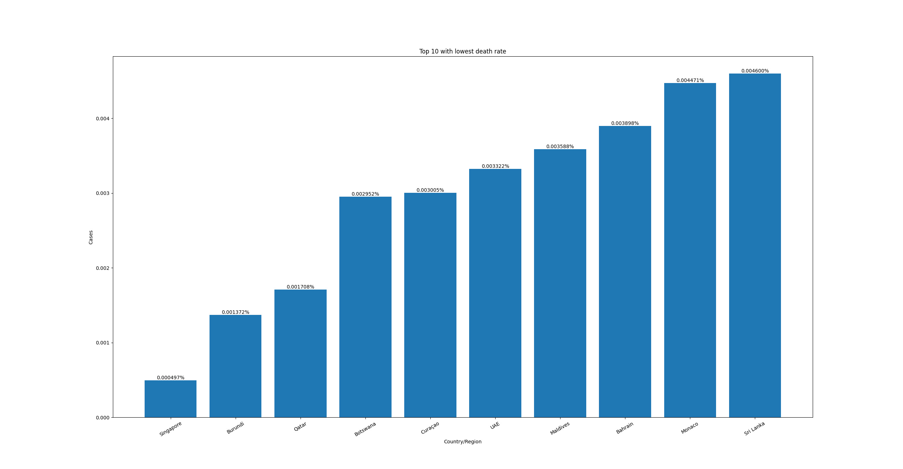

## 用饼图展示各个国家的累计确诊人数的比例（数据较小的国家 可以合并处理）

```python
import os

import matplotlib.pyplot as plt
import numpy as np
import pandas as pd


def loadfile(path=r'G:/Courseware/Python/ScrapyTest/COVIDrequest/data15') -> dict:
    dataframes = {}
    filelz = os.listdir(path)
    for filename in filelz:
        df = pd.read_csv(path + '/' + filename, thousands=',')
        df = df.sort_values(by='Country, Other', ascending=False)
        df = df.reset_index()
        dataframes[filename.partition('.')[0]] = df
    return dataframes


def totalcase(datadict: dict):
    key = '20201216-090001'
    df = datadict[key]
    df = df[df['#'].notna()]
    df = df.sort_values(by='Total Cases', ascending=False)
    return df['Country, Other'].values, df['Total Cases'].values


def main():
    plt.figure(figsize=(6, 9)) 
    dfs = loadfile()  
    loclz, datalz = totalcase(dfs)
    data = np.array(datalz)
    sum = data.sum()
    percent = data / sum

    pos = 15  
    other = 0

    for x in datalz[pos:]:
        other += x

    explode = [0.01]*17
    x = datalz[:pos + 1]
    x = np.append(x, other)
    label = loclz[:pos + 1]
    label = np.append(label, 'others')
    patches = plt.pie(x, labels=label, explode=explode, autopct='%1.5f%%',
                      pctdistance=1, startangle=150)

    plt.title('Total Cases/Population', fontsize=30)
    plt.axis('equal')
    plt.legend(label, loc='best')
    plt.show()


if __name__ == '__main__':
    main()
```

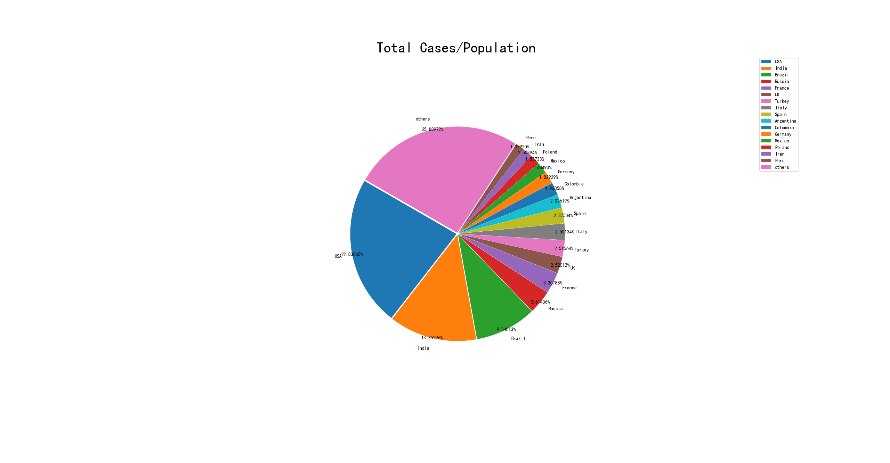

## 展示全球各个国家累计确诊人数的箱型图

```python
import os

import matplotlib.pyplot as plt
import pandas as pd


def loadfile(path=r'G:/Courseware/Python/ScrapyTest/COVIDrequest/data15') -> dict:
    dataframes = {}
    filelz = os.listdir(path)
    for filename in filelz:
        df = pd.read_csv(path + '/' + filename, thousands=',')
        df = df.sort_values(by='Country, Other', ascending=False)
        df = df.reset_index()
        dataframes[filename.partition('.')[0]] = df
    return dataframes


def main():
    dfs = loadfile()
    df = dfs['20201216-090001']
    df = df[df['#'].notna()]
    f = df.boxplot(column=['Total Cases'], meanline=True, showmeans=True, vert=True, return_type='dict')
    plt.text(1.1, df['Total Cases'].mean(), "%.2f" % df['Total Cases'].mean())
    for mean in f['means']:
        mean.set(color='r', linewidth=1)
    plt.title('Total Cases in box figure')
    plt.show()


if __name__ == '__main__':
    main()
```

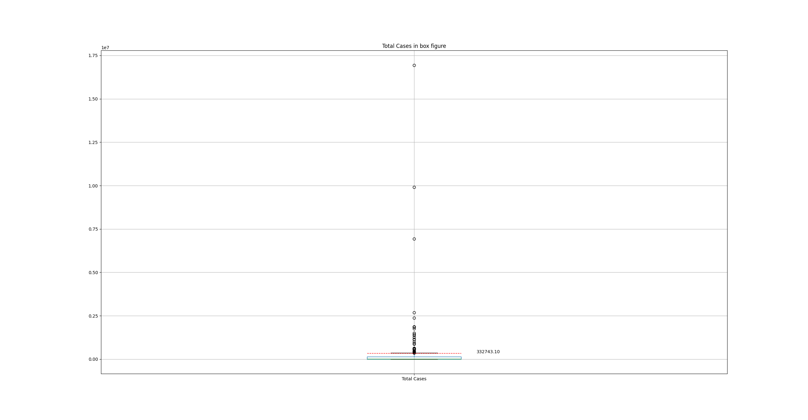

## 其它你希望分析和展示的数据

使用pyecharts和phantomjs库，绘制疫情全球分布热力图。

```python
import os

import pandas as pd
from pyecharts import options as opts
from pyecharts.charts import Map
from pyecharts.render import make_snapshot
from snapshot_phantomjs import snapshot


def loadfile(path=r'G:/Courseware/Python/ScrapyTest/COVIDrequest/data15') -> dict:
    dataframes = {}
    filelz = os.listdir(path)
    for filename in filelz:
        df = pd.read_csv(path + '/' + filename, thousands=',')
        df = df.sort_values(by='Country, Other', ascending=False)
        df = df.reset_index()
        dataframes[filename.partition('.')[0]] = df
    return dataframes


def data():
    dfs = loadfile()
    df = dfs['20201216-090001']
    df = df[df['#'].notna()]

    x, y = df['Country, Other'].values, df['Total Cases'].values
    lz = []

    for i, j in zip(x, y):
        if i == 'USA':
            i = 'United States'
        lz.append([i, j.item()])

    lz.sort(key=lambda x: -x[1])
    return lz


def map_visualmap() -> Map:
    c = (
        Map()
            .add("Coronavirus Heatmap", [z for z in data()], "world")
            .set_global_opts(
            title_opts=opts.TitleOpts(title="Cases"),
            visualmap_opts=opts.VisualMapOpts(min_=0, max_=2000000))
            .set_series_opts(label_opts=opts.LabelOpts(is_show=False))
    )
    return c


make_snapshot(snapshot, map_visualmap().render(), "map1.png")
map_visualmap().render("map" + ".html")
```

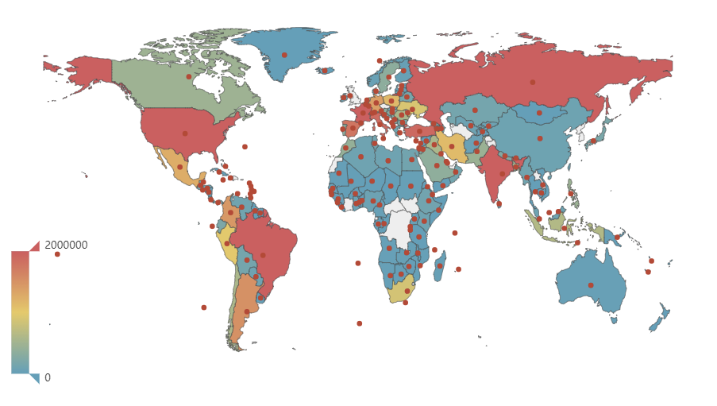

## 根据以上数据，列出全世界应对新冠疫情最好的 10 个国家，并说明你的理由

```python
import os

import matplotlib.pyplot as plt
import numpy as np
import pandas as pd


def loadfile(path=r'G:/Courseware/Python/ScrapyTest/COVIDrequest/data15') -> dict:
    dataframes = {}
    filelz = os.listdir(path)
    for filename in filelz:
        df = pd.read_csv(path + '/' + filename, thousands=',')
        df = df.sort_values(by='Country, Other', ascending=False)
        df = df.reset_index()
        dataframes[filename.partition('.')[0]] = df
    return dataframes


def casePPL(datadict: dict):
    key = '20201216-090001'
    df = datadict[key]
    df = df.sort_values(by='1 Case every X ppl', ascending=False)
    df = df[df['Population'] > 10000000]
    df = df.head(20)

    return df['Country, Other'].values, df['1 Case every X ppl'].values


def main():
    dfs = loadfile()
    fig, ax = plt.subplots()
    loclz, datalz = casePPL(dfs)
    datalz = np.array(datalz)
    datalz = 100 / datalz
    ax.set_title('Top 10 Case/Population')
    x = np.arange(20) + 1
    plt.bar(x, datalz)
    plt.xticks(x, loclz, rotation=40, fontsize='medium')
    ax.set_xlabel('Country/Region')
    ax.set_ylabel('Cases')
    for a, b in zip(x, datalz):
        plt.text(a, b, '%.6f' % b + '%', ha='center', va='bottom', fontsize=10)
    plt.show()


if __name__ == '__main__':
    main()
```

对于人口数量大于1000万人的国家和地区，按照感染人数/人口总数升序排序

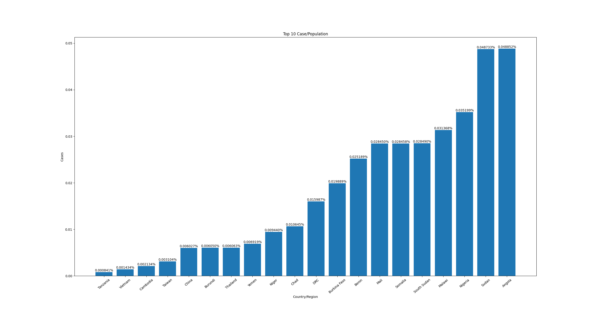

假设人口流动性相似的情况下，感染比例越小的地区越不容易造成病毒的快速扩散。同时，考虑到中国的人口数量大，流动性强，对世界疫情的影响大，因此拥有大人口并且保持了最低的感染率的中国在疫情中防范最好。

## 数据预测

```python
import matplotlib.pyplot as plt
import numpy as np
import os
import pandas as pd


def loadfile(path=r'G:/Courseware/Python/ScrapyTest/COVIDrequest/data15') -> dict:
    dataframes = {}
    filelz = os.listdir(path)
    for filename in filelz:
        df = pd.read_csv(path + '/' + filename, thousands=',')
        df = df.sort_values(by='Country, Other', ascending=False)
        df = df.reset_index()
        dataframes[filename.partition('.')[0]] = df
    return dataframes


def worldtrend(datadict: dict):
    datelz = []
    totlist = []
    for date in datadict:
        df = datadict[date]
        worldtot = df[df['Country, Other'] == 'World']['Total Cases'].values[0]

        totlist.append(worldtot)
        datelz.append(date[-4:])
    return datelz, totlist


def func():
    dfs = loadfile()
    datelz, totlz = worldtrend(dfs)
    print(datelz)
    print(totlz)
    datelz = np.arange(15) + 1
    totlz = totlz[:-1]

    e = [0] * 15

    model = np.polyfit(datelz, totlz, 1)
    plt.plot(datelz, totlz, marker='o', linestyle='-',
             linewidth=4, markersize=10, label='Original')
    add = 0
    for i in range(10, 15):
        oldval = totlz[i]
        totlz[i] = model[0] * (i) + model[1] + add
        e[i] = totlz[i] - oldval
    plt.plot(datelz, totlz, marker='x', linestyle='--',
             linewidth=1, markersize=10, color='r', label='Predict')

    for i in range(10, 15):
        plt.text(datelz[i], totlz[i] - 100, "%d" % e[i])

    plt.title('Trend to Predict')
    plt.grid()
    plt.legend()
    plt.show()


func()
```

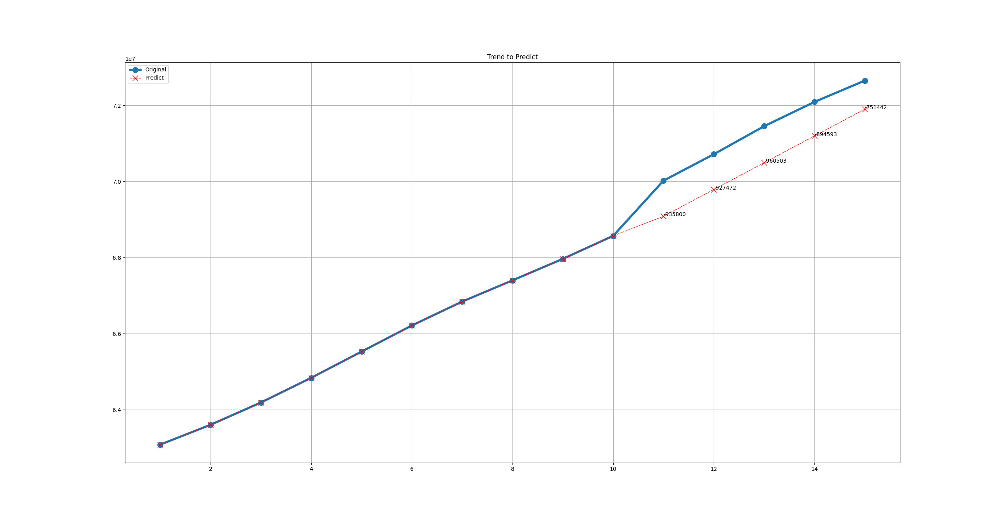

可以看到，预测数据与实际数据的斜率相差不大，说明预测较好地反映了新冠疫情病例的增长情况。