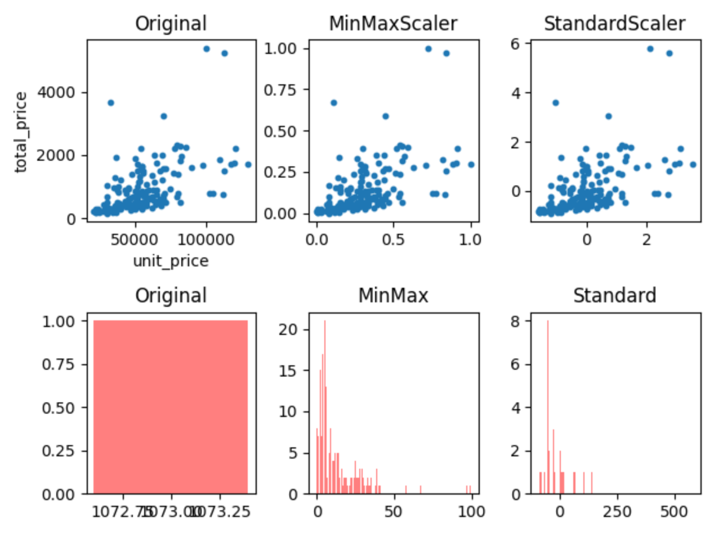

# Python数据预处理作业2

姓名：马嘉骥		班级：2018211303		学号：2018211149

## 环境

* PyCharm 2020，Python 3.9
* numpy，pandas，matplotlib，scikit-learn

## 处理和分析空气质量数据

空气质量指数分级参考 CN AQI 指数分级。

### 代码

```python
import numpy as np
import pandas as pd


def todf(fileName, lz):
    df = pd.read_csv(fileName, encoding='utf-8')
    df.dropna(axis=0, how='all', subset=lz, inplace=True)
    df['sum'] = df[lz].sum(axis=1)
    df['count'] = df[lz].count(axis=1)
    df['ave'] = round(df['sum'] / df['count'], 2)
    df = df[df['year'] == 2015]
    bin = [0, 50, 100, 150, 200, 300, 1000]
    df0 = df.groupby(["year", "month", "day"])
    result = pd.cut(df0['ave'].mean(), bin)
    print(fileName)
    print(pd.value_counts(result))


def main():
    lzBeijing = ['PM_Dongsi', 'PM_Dongsihuan', 'PM_Nongzhanguan', 'PM_US Post']
    lzChengdu = ['PM_Caotangsi', 'PM_Shahepu', 'PM_US Post']
    lzGuangzhou = "PM_City Station,PM_5th Middle School,PM_US Post".split(',')
    lzShanghai = "PM_Jingan,PM_US Post,PM_Xuhui".split(',')
    lzShengyang = "PM_Taiyuanjie,PM_US Post,PM_Xiaoheyan".split(',')
    dic = {
        'BeijingPM20100101_20151231.csv': lzBeijing,
        'ChengduPM20100101_20151231.csv': lzChengdu,
        'GuangzhouPM20100101_20151231.csv': lzGuangzhou,
        'ShanghaiPM20100101_20151231.csv': lzShanghai,
        'ShenyangPM20100101_20151231.csv': lzShengyang
    }
    for file in dic:
        todf(file, dic[file])


if __name__ == '__main__':
    main()
```

### 输出

```
/usr/local/bin/python3.9 /Users/ridd/PycharmProjects/ScrapyTest/PreProcess2/AQI.py
BeijingPM20100101_20151231.csv
(0, 50]        145
(50, 100]      110
(100, 150]      55
(200, 300]      27
(150, 200]      20
(300, 1000]      8
Name: ave, dtype: int64
ChengduPM20100101_20151231.csv
(0, 50]        164
(50, 100]      151
(100, 150]      31
(150, 200]      14
(200, 300]       5
(300, 1000]      0
Name: ave, dtype: int64
GuangzhouPM20100101_20151231.csv
(0, 50]        270
(50, 100]       83
(100, 150]      11
(150, 200]       1
(300, 1000]      0
(200, 300]       0
Name: ave, dtype: int64
ShanghaiPM20100101_20151231.csv
(0, 50]        219
(50, 100]      114
(100, 150]      23
(150, 200]       8
(200, 300]       1
(300, 1000]      0
Name: ave, dtype: int64
ShenyangPM20100101_20151231.csv
(0, 50]        169
(50, 100]      119
(100, 150]      41
(150, 200]      22
(200, 300]       9
(300, 1000]      5
Name: ave, dtype: int64

Process finished with exit code 0

```

这几个城市大部分时间空气质量指数都在 100 以下；总体来说南方代表城市空气质量比北方城市好，沿海城市比内陆城市好。

## 处理和分析北京房价数据

### 异常值

#### 代码

```python
import pandas as pd

if __name__ == '__main__':
    fileNameStr = 'lianjia2.csv'
    df = pd.read_csv(fileNameStr, encoding='utf-8', usecols=(0, 1, 2, 3, 4, 5, 6, 7))
    df.dropna(axis=0, how="any", inplace=True)
    total_price_mean = df['total_price'].mean()
    total_price_std = df['total_price'].std()
    print(total_price_mean - 3 * total_price_std, total_price_mean + 3 *
          total_price_std)
    index_list = df[df['total_price'] > total_price_mean + 3 * total_price_std].index.tolist()
    value_list = df[df['total_price'] > total_price_mean + 3 * total_price_std]
    print("there are {} items:".format(len(index_list)))
    print(index_list)
    print(value_list)
    value_list.to_csv("zz.csv", index=None)
```

#### 输出

```
/usr/local/bin/python3.9 /Users/ridd/PycharmProjects/ScrapyTest/PreProcess2/LianJia.py
-1488.6129330494014 3222.4347455494017
there are 4 items:
[10, 36, 127, 180]
      name firstLoc secondLoc  ...    size unit_price  total_price
10   远洋新天地      门头沟     门头沟其它  ...  1118.0      33000       3689.4
36    润泽御府       朝阳        北苑  ...   540.0     100000       5400.0
127  懋源·璟岳       丰台       玉泉营  ...   465.0     113000       5254.5
180   兴创屹墅       大兴       高米店  ...   464.0      70000       3248.0

[4 rows x 8 columns]

Process finished with exit code 0

```

价格高的原因：远洋新天地：面积大；润泽御府：地段好单价高；懋源·璟岳和兴创屹墅：别墅，配置豪华单价高。

### 图形化

#### 代码

```python
import pandas as pd
import matplotlib.pyplot as plt
from sklearn.preprocessing import StandardScaler
from sklearn.preprocessing import MinMaxScaler


def count_elements(scores):  # 定义转换函数，统计每个数值对应多少个
    scorescount = {}  # 定义一个字典对象
    for i in scores:
        scorescount[int(i)] = scorescount.get(int(i), 0) + 1  # 累加每个分数值
        return scorescount


def count_elements1(scores):  # 定义转换函数，统计每个数值对应多少个
    scorescount = {}  # 定义一个字典对象
    for i in scores:
        scorescount[int(i * 100)] = scorescount.get(int(i * 100), 0) + 1  # 累加每个分数值的人数
    return scorescount


if __name__ == '__main__':
    fileNameStr = 'lianjia2.csv'
    df = pd.read_csv(fileNameStr, encoding='utf-8', usecols=[6, 7])
    df.dropna(axis=0, how="any", inplace=True)
    fig = plt.figure()
    ax1 = fig.add_subplot(231)
    # 子图1:原始图像
    x1 = df["unit_price"]
    y1 = df["total_price"]
    ax1.scatter(x1, y1, s=10)
    ax1.set_xlabel("unit_price")
    ax1.set_ylabel("total_price")
    ax1.set_title("Original")
    print(type(x1))
    # 子图2:(0,1)归一化，采用MinMaxScaler函数
    ax2 = fig.add_subplot(232)
    min = x1.min()
    max = x1.max()
    ave = x1.mean()
    std = x1.std()
    x2 = (x1 - min) / (max - min)
    scaler = MinMaxScaler()
    y_reshape = y1.values.reshape(-1, 1)
    y2 = scaler.fit_transform(y_reshape)
    ax2.scatter(x2, y2, s=10)
    ax2.set_title("MinMaxScaler")
    # 子图3:Z-score归一化，采用StandardScaler函数
    ax3 = fig.add_subplot(233)
    scaler_std = StandardScaler()
    x_reshape = x1.values.reshape(-1, 1)
    x3 = scaler_std.fit_transform(x_reshape)
    y_reshape = y1.values.reshape(-1, 1)
    y3 = scaler_std.fit_transform(y_reshape)
    ax3.scatter(x3, y3, s=10)
    ax3.set_title("StandardScaler")
    # 查看单个特征，在归一化之后的分布有何变化。
    ax4 = fig.add_subplot(234)
    ax5 = fig.add_subplot(235)
    ax6 = fig.add_subplot(236)
    ax4.set_title("Original")
    ax5.set_title("MinMax")
    ax6.set_title("Standard")
    counted1 = count_elements(y1)
    counted2 = count_elements1(y2)
    counted3 = count_elements1(y3)
    ax4.bar(counted1.keys(), counted1.values(), 0.8, alpha=0.5, color='r')
    ax5.bar(counted2.keys(), counted2.values(), 0.8, alpha=0.5, color='r')
    ax6.bar(counted3.keys(), counted3.values(), 0.8, alpha=0.5, color='r')
    plt.show()
```

#### 输出





### 离散化

按照[0, 40000, 50000, 60000, 80000, 140000]分级，因为大多数房子价格集中在 50000-60000 之间，所以这附近区间比较密，而低价和高价比较稀疏。

#### 代码

```python
import pandas as pd

if __name__ == '__main__':
    fileNameStr = 'lianjia2.csv'
    df = pd.read_csv(fileNameStr, encoding='utf-8', usecols=(0, 1, 2, 3, 4, 5, 6, 7))
    df.dropna(axis=0, how="any", inplace=True)
    sections = [0, 40000, 50000, 60000, 80000, 140000]
    section_names = ["0-40000", "40001-50000", "50000-60000", "60001-80000", "80001-140000"]
    result = pd.cut(df['unit_price'], sections, labels=section_names)
    print("房屋数量")
    print(pd.value_counts(result))
    print("\n房屋比例")
    print(pd.value_counts(result, normalize=True))
```

#### 输出

```
/usr/local/bin/python3.9 /Users/ridd/PycharmProjects/ScrapyTest/PreProcess2/Discrete.py
房屋数量
50000-60000     47
0-40000         46
60001-80000     34
40001-50000     31
80001-140000    18
Name: unit_price, dtype: int64

房屋比例
50000-60000     0.267045
0-40000         0.261364
60001-80000     0.193182
40001-50000     0.176136
80001-140000    0.102273
Name: unit_price, dtype: float64

Process finished with exit code 0

```

