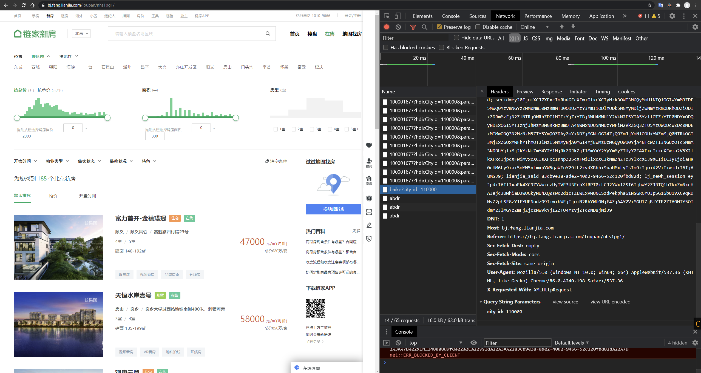
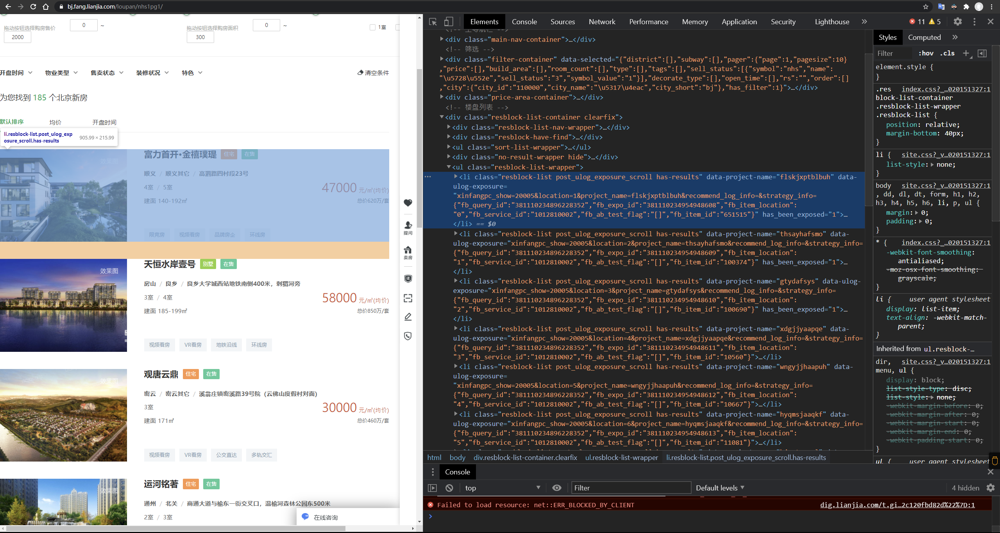
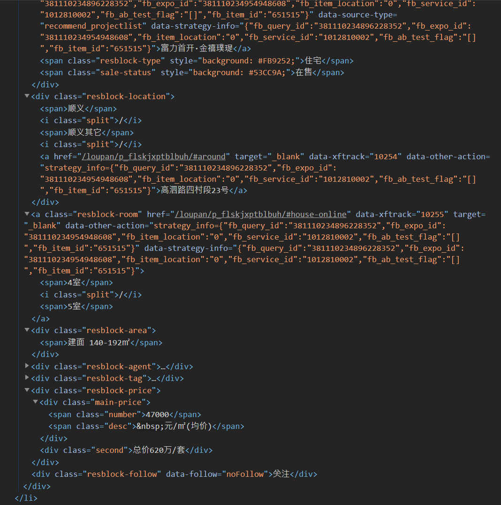

# Python 爬虫实验报告

###### 姓名：马嘉骥	学号：2018211149	班级：2018211303

# 链家网

## 实验目标

* 爬取链家网北京新房的数据。`https://bj.fang.lianjia.com/loupan/nhs1`
* 将楼盘名称、价格、平米数保存到 json 文件中。

## 系统环境

* Windows 10 2004、macOS 10.15
* PyCharm 2020
* Python 3.7、Scrapy 2.4.0

## 项目结构

* ScrapyTest
	* scrapytest
		* spiders
			* \_\_init\_\_.py
			* spider.py
		* \_\_init\_\_.py
		* items.py
		* middlewares.py
		* pipelines.py
		* settings.py
	* begin.py
	* LianJiaData.json
	* scrapy.cfg

## 网页分析

* 点进链家网北京新房页面，URL 默认为 `https://bj.fang.lianjia.com/loupan/nhs1` 。点击第二页，URL 为`https://bj.fang.lianjia.com/loupan/nhs1pg2`。经过测试发现，`https://bj.fang.lianjia.com/loupan/nhs1`和`https://bj.fang.lianjia.com/loupan/nhs1pg1`两个 URL 均指向新房页面第一页。所以在设置起始 URL 时，只需要使用计数器更改`pg{i}`中的内容即可。
* 在 Chromium 内核的浏览器中按 F12 打开开发者工具，在 Network 选项卡中打开记录，刷新页面。筛选器中选择仅显示 XHR XMLHTTPRequest，发现 Query String Parameters仅为城市信息，并且 Request Headers 里没有特别参数。因此该网页应该不需要构造 Header 爬取。



* 切换到 Elements可以看到每个房源展示的信息存放在`/html/body/div[4]/ul[2]/li[*]`位置。



* 展开可以看到这个 block 内存放了需要的信息。



## 代码实现

* begin.py

```python
from scrapy import cmdline

cmdline.execute("scrapy crawl LJ".split())
```

* items.py

```python
import scrapy


class LjItem(scrapy.Item):
    Name = scrapy.Field()
    ResidenceType = scrapy.Field()
    IsOnSale = scrapy.Field()
    LocationDistrict = scrapy.Field()
    LocationBlock = scrapy.Field()
    LocationAddr = scrapy.Field()
    LDK = scrapy.Field()
    AreaSize = scrapy.Field()
    PricePerSqM = scrapy.Field()
    PricePerSuite = scrapy.Field()
```

* spider.py

```python
import scrapy
from ScrapyLianJia.scrapytest.items import LjItem

page = 3 # 爬取3页


class LianJiaSpider(scrapy.Spider):
    name = "LJ"
    allowed_domains = ["bj.fang.lianjia.com"]
    start_urls = []
    if page >= 1:  # 根据待爬取页面数量，添加起始链接
        for i in range(1, page + 1):
            start_urls.append(f"https://bj.fang.lianjia.com/loupan/nhs1pg{i}")

    def parse(self, response, **kwargs):
        item = LjItem()

        for each in response.xpath("/html/body/div[4]/ul[2]/*"):  # 将每一条房源数据进行整理
            item['Name'] = each.xpath("div/div[1]/a/text()").extract()
            item['ResidenceType'] = each.xpath('div/div[1]/span[@class="resblock-type"]/text()').extract()
            item['IsOnSale'] = each.xpath('div/div[1]/span[@class="sale-status"]/text()').extract()
            item['LocationDistrict'] = each.xpath('div/div[2]/span[1]/text()').extract()
            item['LocationBlock'] = each.xpath('div/div[2]/span[2]/text()').extract()
            item['LocationAddr'] = each.xpath('div/div[2]/a/text()').extract()
            item['LDK'] = []
            for room in each.xpath('div/a/*'):  # 对LDK内容进行格式整理
                item['LDK'] += room.xpath('text()').extract()
                if item['LDK'][-1] == '/':
                    del item['LDK'][-1]
            item['AreaSize'] = each.xpath('div/div[3]/span/text()').extract()
            item['PricePerSqM'] = [f"均价{each.xpath('div/div[6]/div[1]/span[1]/text()').extract()[0]}元/平方米"]
            item['PricePerSuite'] = each.xpath('div/div[6]/div[2]/text()').extract()

            yield item  # yield传递数据给下一个
```

* pipelines.py

```python
import json


class LjPipeline:
    def open_spider(self, spider):
        try:
            self.file = open("LianJiaData.json", "w", encoding="utf-8")
        except Exception as err:
            print(err)

    def process_item(self, item, spider): # 数据根据json格式导出到csv
        dict_item = dict(item)
        json_str = json.dumps(dict_item, ensure_ascii=False) + ',\n'
        self.file.write(json_str)
        return item

    def close_spider(self, spider):
        self.file.close()
```

* settings.py

```json
BOT_NAME = 'scrapytest'

SPIDER_MODULES = ['scrapytest.spiders']
NEWSPIDER_MODULE = 'scrapytest.spiders'

# Crawl responsibly by identifying yourself (and your website) on the user-agent
USER_AGENT = 'Mozilla/5.0 (Windows NT 10.0; Win64; x64) AppleWebKit/537.36 (KHTML, like Gecko) Chrome/86.0.4240.198 Safari/537.36'

# Obey robots.txt rules
ROBOTSTXT_OBEY = False

# Configure item pipelines
ITEM_PIPELINES = {
'scrapytest.pipelines.LjPipeline': 300,
}
```

## 运行结果

* LianJiaData.json

```json
{"Name": ["富力首开·金禧璞瑅"], "ResidenceType": ["住宅"], "IsOnSale": ["在售"], "LocationDistrict": ["顺义"], "LocationBlock": ["顺义其它"], "LocationAddr": ["高泗路四村段23号"], "LDK": ["4室", "5室"], "AreaSize": ["建面 140-192㎡"], "PricePerSqM": ["均价47000元/平方米"], "PricePerSuite": ["总价620万/套"]},
{"Name": ["天恒水岸壹号"], "ResidenceType": ["别墅"], "IsOnSale": ["在售"], "LocationDistrict": ["房山"], "LocationBlock": ["良乡"], "LocationAddr": ["良乡大学城西站地铁南侧400米，刺猬河旁"], "LDK": ["3室", "4室"], "AreaSize": ["建面 185-199㎡"], "PricePerSqM": ["均价58000元/平方米"], "PricePerSuite": ["总价850万/套"]},
{"Name": ["观唐云鼎"], "ResidenceType": ["住宅"], "IsOnSale": ["在售"], "LocationDistrict": ["密云"], "LocationBlock": ["密云其它"], "LocationAddr": ["溪翁庄镇密溪路39号院（云佛山度假村对面）"], "LDK": ["3室"], "AreaSize": ["建面 171㎡"], "PricePerSqM": ["均价30000元/平方米"], "PricePerSuite": ["总价460万/套"]},
{"Name": ["运河铭著"], "ResidenceType": ["住宅"], "IsOnSale": ["在售"], "LocationDistrict": ["通州"], "LocationBlock": ["北关"], "LocationAddr": ["商通大道与榆东一街交叉口，温榆河森林公园东500米"], "LDK": ["2室", "3室"], "AreaSize": ["建面 100-140㎡"], "PricePerSqM": ["均价46000元/平方米"], "PricePerSuite": ["总价460万/套"]},
{"Name": ["万年广阳郡九号"], "ResidenceType": ["住宅"], "IsOnSale": ["在售"], "LocationDistrict": ["房山"], "LocationBlock": ["长阳"], "LocationAddr": ["长阳清苑南街与汇商东路交汇处西北角"], "LDK": ["3室", "4室"], "AreaSize": ["建面 139-189㎡"], "PricePerSqM": ["均价48500元/平方米"], "PricePerSuite": ["总价820万/套"]},
{"Name": ["华远裘马四季"], "ResidenceType": ["住宅"], "IsOnSale": ["在售"], "LocationDistrict": ["门头沟"], "LocationBlock": ["大峪"], "LocationAddr": ["增产路16号院"], "LDK": ["3室", "4室"], "AreaSize": ["建面 150-191㎡"], "PricePerSqM": ["均价60000元/平方米"], "PricePerSuite": ["总价1000万/套"]},
{"Name": ["合景映月台"], "ResidenceType": ["别墅"], "IsOnSale": ["在售"], "LocationDistrict": ["海淀"], "LocationBlock": ["清河"], "LocationAddr": ["安宁庄西路与小营西路交汇处西南侧, 安宁庄西路与小营西路36号院项目"], "LDK": ["4室"], "AreaSize": ["建面 182-290㎡"], "PricePerSqM": ["均价2200元/平方米"], "PricePerSuite": []},
{"Name": ["V7九间堂"], "ResidenceType": ["别墅"], "IsOnSale": ["在售"], "LocationDistrict": ["通州"], "LocationBlock": ["潞苑"], "LocationAddr": ["通燕高速耿庄桥北出口中化石油对面"], "LDK": ["4室", "8室"], "AreaSize": ["建面 220-420㎡"], "PricePerSqM": ["均价68000元/平方米"], "PricePerSuite": ["总价1600万/套"]},
{"Name": ["御汤山熙园"], "ResidenceType": ["别墅"], "IsOnSale": ["在售"], "LocationDistrict": ["昌平"], "LocationBlock": ["昌平其它"], "LocationAddr": ["紧邻安泗路，距离北六环61号出口约2000米"], "LDK": ["4室"], "AreaSize": ["建面 300-470㎡"], "PricePerSqM": ["均价40000元/平方米"], "PricePerSuite": ["总价1800万/套"]},
{"Name": ["华远和墅"], "ResidenceType": ["别墅"], "IsOnSale": ["在售"], "LocationDistrict": ["大兴"], "LocationBlock": ["南中轴机场商务区"], "LocationAddr": ["南六环磁各庄桥沿南中轴向南2公里"], "LDK": ["5室"], "AreaSize": ["建面 295㎡"], "PricePerSqM": ["均价54000元/平方米"], "PricePerSuite": ["总价1580万/套"]},
{"Name": ["天资华府"], "ResidenceType": ["住宅"], "IsOnSale": ["在售"], "LocationDistrict": ["房山"], "LocationBlock": ["长阳"], "LocationAddr": ["房山区CSD政务大厅5号门"], "LDK": ["2室", "3室", "4室", "5室"], "AreaSize": ["建面 94-293㎡"], "PricePerSqM": ["均价410000元/平方米"], "PricePerSuite": ["总价480万/套"]},
{"Name": ["檀香府"], "ResidenceType": ["别墅"], "IsOnSale": ["在售"], "LocationDistrict": ["门头沟"], "LocationBlock": ["门头沟其它"], "LocationAddr": ["京潭大街与潭柘十街交叉口"], "LDK": ["3室", "4室"], "AreaSize": ["建面 208-320㎡"], "PricePerSqM": ["均价43000元/平方米"], "PricePerSuite": []},
{"Name": ["观山源墅"], "ResidenceType": ["别墅"], "IsOnSale": ["在售"], "LocationDistrict": ["房山"], "LocationBlock": ["良乡"], "LocationAddr": ["阳光北大街与多宝路交汇处西南（理工大学北校区西侧）"], "LDK": ["3室", "5室"], "AreaSize": ["建面 290-437㎡"], "PricePerSqM": ["均价47500元/平方米"], "PricePerSuite": ["总价1250万/套"]},
{"Name": ["西山甲一号"], "ResidenceType": ["住宅"], "IsOnSale": ["在售"], "LocationDistrict": ["丰台"], "LocationBlock": ["丰台其它"], "LocationAddr": ["长辛店生态城园博园南路路北500米"], "LDK": ["3室", "4室"], "AreaSize": ["建面 118-183㎡"], "PricePerSqM": ["均价57000元/平方米"], "PricePerSuite": ["总价700万/套"]},
{"Name": ["电建金地华宸"], "ResidenceType": ["住宅"], "IsOnSale": ["在售"], "LocationDistrict": ["门头沟"], "LocationBlock": ["门头沟其它"], "LocationAddr": ["长安街西延线南侧约500米"], "LDK": ["3室"], "AreaSize": ["建面 180-247㎡"], "PricePerSqM": ["均价64000元/平方米"], "PricePerSuite": ["总价1400万/套"]},
{"Name": ["首创天阅西山"], "ResidenceType": ["住宅"], "IsOnSale": ["在售"], "LocationDistrict": ["海淀"], "LocationBlock": ["海淀北部新区"], "LocationAddr": ["永丰路与北清路交汇处东北角，中关村壹号北"], "LDK": ["3室", "4室"], "AreaSize": ["建面 175-245㎡"], "PricePerSqM": ["均价80000元/平方米"], "PricePerSuite": ["总价1500万/套"]},
{"Name": ["西山燕庐"], "ResidenceType": ["住宅"], "IsOnSale": ["在售"], "LocationDistrict": ["门头沟"], "LocationBlock": ["门头沟其它"], "LocationAddr": ["长安街延线南约500米"], "LDK": ["3室", "4室"], "AreaSize": ["建面 137-196㎡"], "PricePerSqM": ["均价65000元/平方米"], "PricePerSuite": ["总价850万/套"]},
{"Name": ["北科建泰禾丽春湖院子"], "ResidenceType": ["别墅"], "IsOnSale": ["在售"], "LocationDistrict": ["昌平"], "LocationBlock": ["沙河"], "LocationAddr": ["中关村北延新核心，沙河水库边（地铁昌平线沙河站向南800米）"], "LDK": ["4室"], "AreaSize": ["建面 379-800㎡"], "PricePerSqM": ["均价50000元/平方米"], "PricePerSuite": ["总价1900万/套"]},
{"Name": ["首开国风尚樾"], "ResidenceType": ["住宅"], "IsOnSale": ["在售"], "LocationDistrict": ["朝阳"], "LocationBlock": ["望京"], "LocationAddr": ["望京南湖南路三帆中学对面"], "LDK": ["3室", "4室"], "AreaSize": ["建面 146-210㎡"], "PricePerSqM": ["均价120000元/平方米"], "PricePerSuite": ["总价1960万/套"]},
{"Name": ["绿地海珀云翡"], "ResidenceType": ["住宅"], "IsOnSale": ["在售"], "LocationDistrict": ["大兴"], "LocationBlock": ["大兴其它"], "LocationAddr": ["兴亦路京开高速东侧（黄村镇第一中心小学对面）"], "LDK": ["2室", "3室"], "AreaSize": ["建面 102-178㎡"], "PricePerSqM": ["均价70000元/平方米"], "PricePerSuite": ["总价700万/套"]},
{"Name": ["中粮京西祥云"], "ResidenceType": ["住宅"], "IsOnSale": ["在售"], "LocationDistrict": ["房山"], "LocationBlock": ["长阳"], "LocationAddr": ["地铁稻田站北800米，西邻京深路"], "LDK": ["4室"], "AreaSize": ["建面 115-140㎡"], "PricePerSqM": ["均价58000元/平方米"], "PricePerSuite": ["总价680万/套"]},
{"Name": ["燕西华府"], "ResidenceType": ["住宅"], "IsOnSale": ["在售"], "LocationDistrict": ["丰台"], "LocationBlock": ["丰台其它"], "LocationAddr": ["王佐镇青龙湖公园东1500米, 泉湖西路1号院（七区）, 泉湖西路1号院（六区）"], "LDK": ["4室"], "AreaSize": ["建面 60-288㎡"], "PricePerSqM": ["均价49800元/平方米"], "PricePerSuite": ["总价650万/套"]},
{"Name": ["远洋新天地"], "ResidenceType": ["商业"], "IsOnSale": ["在售"], "LocationDistrict": ["门头沟"], "LocationBlock": ["门头沟其它"], "LocationAddr": ["长安街西延线与滨河路南延交汇处（东南侧）"], "LDK": [], "AreaSize": [], "PricePerSqM": ["均价70000元/平方米"], "PricePerSuite": ["总价260万/套"]},
{"Name": ["天恒水岸壹号"], "ResidenceType": ["住宅"], "IsOnSale": ["在售"], "LocationDistrict": ["房山"], "LocationBlock": ["良乡"], "LocationAddr": ["良乡大学城西站地铁南侧800米，刺猬河旁"], "LDK": ["3室", "4室"], "AreaSize": ["建面 122-148㎡"], "PricePerSqM": ["均价52000元/平方米"], "PricePerSuite": ["总价490万/套"]},
{"Name": ["天恒摩墅"], "ResidenceType": ["别墅"], "IsOnSale": ["在售"], "LocationDistrict": ["房山"], "LocationBlock": ["房山其它"], "LocationAddr": ["周口店镇政府东200米"], "LDK": ["3室"], "AreaSize": ["建面 140-160㎡"], "PricePerSqM": ["均价29555元/平方米"], "PricePerSuite": ["总价339万/套"]},
{"Name": ["兴创荣墅"], "ResidenceType": ["别墅"], "IsOnSale": ["在售"], "LocationDistrict": ["大兴"], "LocationBlock": ["大兴新机场洋房别墅区"], "LocationAddr": ["采育镇育胜街与福源路交叉口西侧350米路南"], "LDK": ["3室", "4室", "5室"], "AreaSize": ["建面 240-411㎡"], "PricePerSqM": ["均价37500元/平方米"], "PricePerSuite": ["总价1100万/套"]},
{"Name": ["观山源墅"], "ResidenceType": ["住宅"], "IsOnSale": ["在售"], "LocationDistrict": ["房山"], "LocationBlock": ["良乡"], "LocationAddr": ["阳光北大街与多宝路交汇处西南（理工大学北校区西侧）"], "LDK": ["3室", "4室"], "AreaSize": ["建面 94-150㎡"], "PricePerSqM": ["均价47500元/平方米"], "PricePerSuite": ["总价437万/套"]},
{"Name": ["润泽御府"], "ResidenceType": ["别墅"], "IsOnSale": ["在售"], "LocationDistrict": ["朝阳"], "LocationBlock": ["北苑"], "LocationAddr": ["北京市朝阳区北五环顾家庄桥向北约2.6公里"], "LDK": ["4室", "5室"], "AreaSize": ["建面 540-1600㎡"], "PricePerSqM": ["均价100000元/平方米"], "PricePerSuite": ["总价5000万/套"]},
{"Name": ["中骏西山天璟"], "ResidenceType": ["住宅"], "IsOnSale": ["在售"], "LocationDistrict": ["门头沟"], "LocationBlock": ["城子"], "LocationAddr": ["西山永定楼北300米"], "LDK": ["4室"], "AreaSize": ["建面 117-155㎡"], "PricePerSqM": ["均价65000元/平方米"], "PricePerSuite": ["总价600万/套"]},
{"Name": ["领秀翡翠墅"], "ResidenceType": ["住宅"], "IsOnSale": ["在售"], "LocationDistrict": ["丰台"], "LocationBlock": ["丰台其它"], "LocationAddr": ["王佐镇长青路南侧, 长青路88号院"], "LDK": ["3室", "4室"], "AreaSize": ["建面 137-187㎡"], "PricePerSqM": ["均价45000元/平方米"], "PricePerSuite": ["总价630万/套"]},
```

* 控制台输出

```
C:\Users\Ridd\PycharmProjects\venv\Scripts\python.exe G:/Courseware/Python程序设计实践/ScrapyTest/begin.py
2020-11-17 15:26:47 [scrapy.utils.log] INFO: Scrapy 2.4.0 started (bot: scrapytest)
2020-11-17 15:26:47 [scrapy.utils.log] INFO: Versions: lxml 4.6.1.0, libxml2 2.9.5, cssselect 1.1.0, parsel 1.6.0, w3lib 1.22.0, Twisted 20.3.0, Python 3.7.8 (tags/v3.7.8:4b47a5b6ba, Jun 28 2020, 08:53:46) [MSC v.1916 64 bit (AMD64)], pyOpenSSL 19.1.0 (OpenSSL 1.1.1h  22 Sep 2020), cryptography 3.2.1, Platform Windows-10-10.0.19041-SP0
2020-11-17 15:26:47 [scrapy.utils.log] DEBUG: Using reactor: twisted.internet.selectreactor.SelectReactor
2020-11-17 15:26:47 [scrapy.crawler] INFO: Overridden settings:
{'BOT_NAME': 'scrapytest',
 'NEWSPIDER_MODULE': 'scrapytest.spiders',
 'SPIDER_MODULES': ['scrapytest.spiders'],
 'USER_AGENT': 'Mozilla/5.0 (Windows NT 10.0; Win64; x64) AppleWebKit/537.36 '
               '(KHTML, like Gecko) Chrome/86.0.4240.198 Safari/537.36'}
2020-11-17 15:26:47 [scrapy.extensions.telnet] INFO: Telnet Password: 014acec50424ab08
2020-11-17 15:26:47 [scrapy.middleware] INFO: Enabled extensions:
['scrapy.extensions.corestats.CoreStats',
 'scrapy.extensions.telnet.TelnetConsole',
 'scrapy.extensions.logstats.LogStats']
2020-11-17 15:26:47 [scrapy.middleware] INFO: Enabled downloader middlewares:
['scrapy.downloadermiddlewares.httpauth.HttpAuthMiddleware',
 'scrapy.downloadermiddlewares.downloadtimeout.DownloadTimeoutMiddleware',
 'scrapy.downloadermiddlewares.defaultheaders.DefaultHeadersMiddleware',
 'scrapy.downloadermiddlewares.useragent.UserAgentMiddleware',
 'scrapy.downloadermiddlewares.retry.RetryMiddleware',
 'scrapy.downloadermiddlewares.redirect.MetaRefreshMiddleware',
 'scrapy.downloadermiddlewares.httpcompression.HttpCompressionMiddleware',
 'scrapy.downloadermiddlewares.redirect.RedirectMiddleware',
 'scrapy.downloadermiddlewares.cookies.CookiesMiddleware',
 'scrapy.downloadermiddlewares.httpproxy.HttpProxyMiddleware',
 'scrapy.downloadermiddlewares.stats.DownloaderStats']
2020-11-17 15:26:47 [scrapy.middleware] INFO: Enabled spider middlewares:
['scrapy.spidermiddlewares.httperror.HttpErrorMiddleware',
 'scrapy.spidermiddlewares.offsite.OffsiteMiddleware',
 'scrapy.spidermiddlewares.referer.RefererMiddleware',
 'scrapy.spidermiddlewares.urllength.UrlLengthMiddleware',
 'scrapy.spidermiddlewares.depth.DepthMiddleware']
2020-11-17 15:26:47 [scrapy.middleware] INFO: Enabled item pipelines:
['scrapytest.pipelines.LjPipeline']
2020-11-17 15:26:47 [scrapy.core.engine] INFO: Spider opened
2020-11-17 15:26:47 [scrapy.extensions.logstats] INFO: Crawled 0 pages (at 0 pages/min), scraped 0 items (at 0 items/min)
2020-11-17 15:26:47 [scrapy.extensions.telnet] INFO: Telnet console listening on 127.0.0.1:6023
2020-11-17 15:26:47 [scrapy.core.engine] DEBUG: Crawled (200) <GET https://bj.fang.lianjia.com/loupan/nhs1pg1> (referer: None)
2020-11-17 15:26:48 [scrapy.core.engine] DEBUG: Crawled (200) <GET https://bj.fang.lianjia.com/loupan/nhs1pg2> (referer: None)
2020-11-17 15:26:48 [scrapy.core.engine] DEBUG: Crawled (200) <GET https://bj.fang.lianjia.com/loupan/nhs1pg3> (referer: None)
2020-11-17 15:26:48 [scrapy.core.scraper] DEBUG: Scraped from <200 https://bj.fang.lianjia.com/loupan/nhs1pg1>
{'AreaSize': ['建面 140-192㎡'],
 'IsOnSale': ['在售'],
 'LDK': ['4室', '5室'],
 'LocationAddr': ['高泗路四村段23号'],
 'LocationBlock': ['顺义其它'],
 'LocationDistrict': ['顺义'],
 'Name': ['富力首开·金禧璞瑅'],
 'PricePerSqM': ['均价47000元/平方米'],
 'PricePerSuite': ['总价620万/套'],
 'ResidenceType': ['住宅']}
……
略
……
2020-11-17 15:26:48 [scrapy.core.scraper] DEBUG: Scraped from <200 https://bj.fang.lianjia.com/loupan/nhs1pg3>
{'AreaSize': ['建面 137-187㎡'],
 'IsOnSale': ['在售'],
 'LDK': ['3室', '4室'],
 'LocationAddr': ['王佐镇长青路南侧, 长青路88号院'],
 'LocationBlock': ['丰台其它'],
 'LocationDistrict': ['丰台'],
 'Name': ['领秀翡翠墅'],
 'PricePerSqM': ['均价45000元/平方米'],
 'PricePerSuite': ['总价630万/套'],
 'ResidenceType': ['住宅']}
2020-11-17 15:26:48 [scrapy.core.engine] INFO: Closing spider (finished)
2020-11-17 15:26:48 [scrapy.statscollectors] INFO: Dumping Scrapy stats:
{'downloader/request_bytes': 942,
 'downloader/request_count': 3,
 'downloader/request_method_count/GET': 3,
 'downloader/response_bytes': 131115,
 'downloader/response_count': 3,
 'downloader/response_status_count/200': 3,
 'elapsed_time_seconds': 0.681371,
 'finish_reason': 'finished',
 'finish_time': datetime.datetime(2020, 11, 17, 7, 26, 48, 198034),
 'item_scraped_count': 30,
 'log_count/DEBUG': 33,
 'log_count/INFO': 10,
 'response_received_count': 3,
 'scheduler/dequeued': 3,
 'scheduler/dequeued/memory': 3,
 'scheduler/enqueued': 3,
 'scheduler/enqueued/memory': 3,
 'start_time': datetime.datetime(2020, 11, 17, 7, 26, 47, 516663)}
2020-11-17 15:26:48 [scrapy.core.engine] INFO: Spider closed (finished)

Process finished with exit code 0
```


# 学堂在线网

## 实验目标

* 爬取学堂在线的合作院校页面内容。
* 将开课院校的学校名称和对应的课程数量，保存到一个 json 文件中。

## 系统环境

* Windows 10 2004、macOS 10.15
* PyCharm 2020
* Python 3.7、Requests 2.25.0

## 项目结构

* main.py
* xuetangx.csv

## 代码实现

```python
import codecs
import csv
import json

import requests

payload = {"query": "", "chief_org": [], "classify": ["1"], "selling_type": [], "status": [], "appid": 10000}
header = {
    "user-agent": "Mozilla/5.0 (Windows NT 10.0; Win64; x64) AppleWebKit/537.36 (KHTML, like Gecko) "
                  "Chrome/86.0.4240.198 Safari/537.36",
    "x-client": "web",
    "xtbz": "xt"
}
base_url = "https://www.xuetangx.com/api/v1/lms/get_product_list/?page="


def post(page_num: int) -> dict:
    x = requests.post(base_url + str(page_num), headers=header, data=payload)
    y = json.loads(x.text)
    # print("post page"+str(page_num)+" ends")
    return y


def add2csv(json_obj: dict, csv_writer):
    class_list = json_obj["data"]["product_list"]
    for item in class_list:
        name = item['name']
        school = item["org"]['name']
        count = item['count']
        teacher_list = []
        for teacher in item['teacher']:
            teacher_list.append(teacher['name'])
        content = [name, count, school, "、".join(teacher_list)]
        csv_writer.writerow(content)
        # print(content)


def main():
    total_page_num = 37
    with codecs.open("xuetangx.csv", "w", encoding="utf-8") as csvf:
        writer = csv.writer(csvf)
        writer.writerow(["课程名称", "选课人数", "学校", "老师"])
        for i in range(1, total_page_num + 1):
            ret_json = post(i)
            add2csv(ret_json, writer)


if __name__ == "__main__":
    main()
```


## 运行结果

* xuetangx.csv

```
课程名称,选课人数,学校,老师
C++语言程序设计基础,424200,清华大学,郑莉、李超、徐明星
数据结构(上),410783,清华大学,邓俊辉
数据结构（下）,358574,清华大学,邓俊辉
Java程序设计,195257,清华大学,郑莉
操作系统,193059,清华大学,向勇、陈渝
网络技术与应用,175781,中国人民解放军陆军工程大学,沈鑫剡、俞海英、李兴德、许继恒、钱万正、徐海斌、魏涛、宋以胜
C++语言程序设计进阶,117467,清华大学,郑莉、李超、徐明星
C程序设计案例教程（基础）,113433,中国农业大学,张莉
C程序设计案例教程（进阶）,110253,中国农业大学,张莉
数据挖掘：理论与算法,107925,清华大学,袁博
大数据技术与应用,97955,清华大学,李军
软件工程,93732,清华大学,刘强、刘璘
计算机文化基础,83714,清华大学,李秀、姚瑞霞、安颖莲、全成斌
程序设计基础,80793,清华大学,徐明星、王瑀屏、邬晓钧
组合数学,74396,清华大学,马昱春
大数据系统基础,74247,清华大学,王建民、徐葳、陈康、陈文光
VC++面向对象与可视化程序设计（上）：Windows编程基础,69321,清华大学,黄维通
VC++面向对象与可视化程序设计（下）：MFC编程基础,67921,清华大学,黄维通
人工智能原理,63706,北京大学,王文敏
大数据平台核心技术,62951,清华大学,武永卫、姚文辉、陶阳宇、冯骁、谢德军
大学计算机教程,62258,中国农业大学,张莉、马钦
Web前端攻城狮,57698,清华大学,刘强、吴亮、赵文博
Office办公软件应用,57532,河北工业大学,史巧硕、朱怀忠、刘洪普、李娟
汇编语言程序设计,55233,清华大学,张悠慧、翟季冬
……
略
……
```