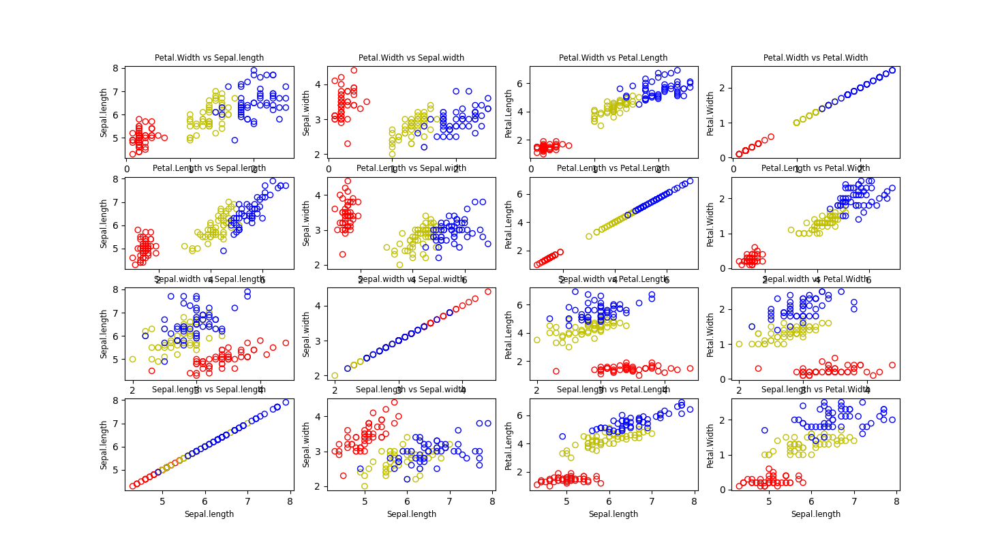
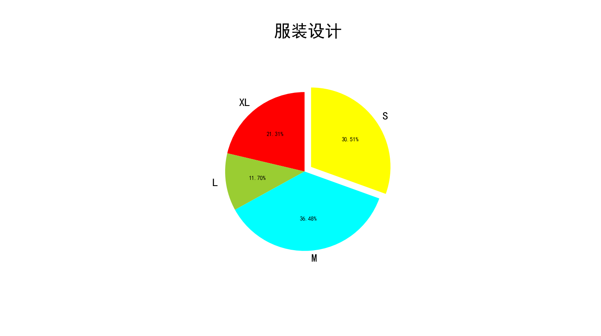
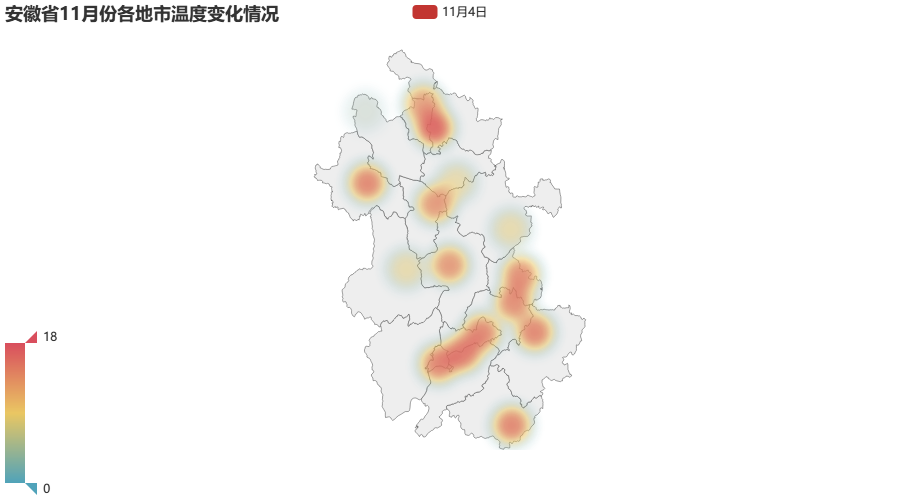
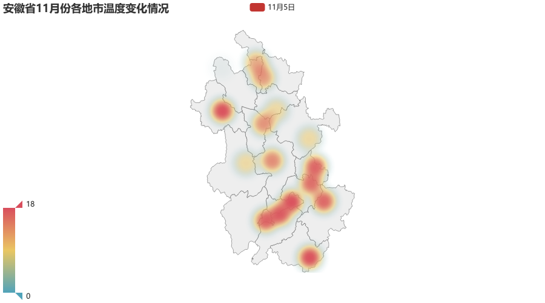
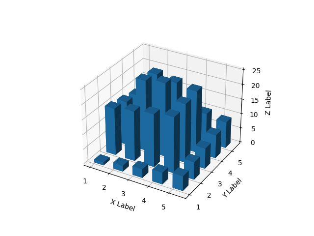
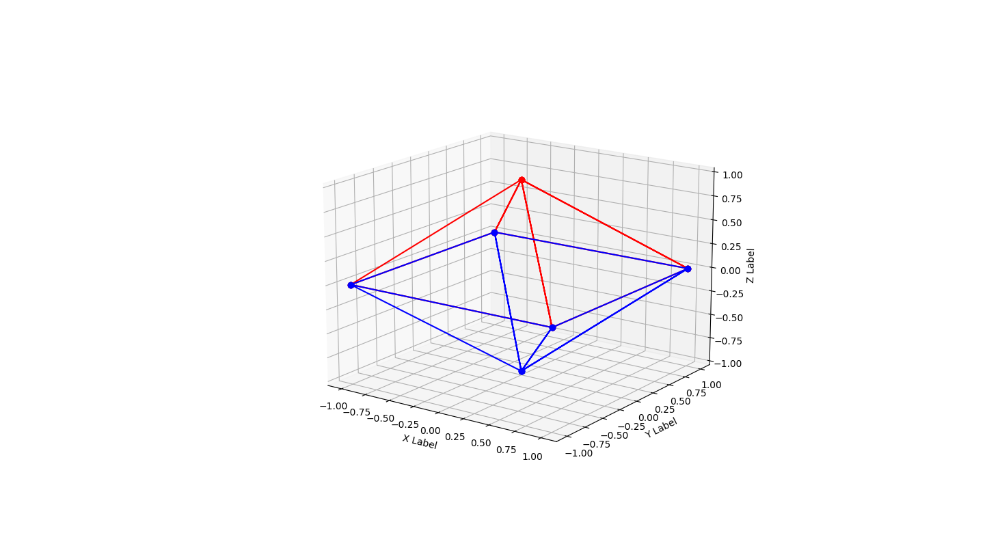
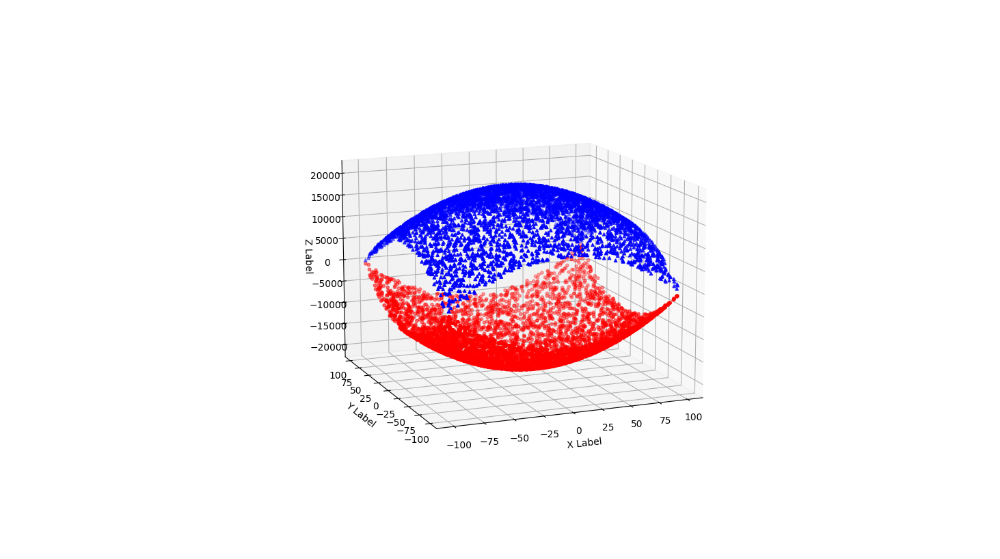

# 数据可视化作业

**姓名：**路修远 **学号：**2018211148 **班级：**2018211303

# 作业1

使用IRIS数据集，在一个figure中绘 制出右侧的16个子图。 分别使用花瓣长度、花瓣宽度、花 萼长度和花萼宽度这四种数据，两 两组合，形成散点。

```python
import numpy as np
import pandas as pd
import matplotlib.pyplot as plt

# 读取数据
BasePath = r'D:\python_repo\homework\11\sample'  # cvs文件的保存路径
iris = pd.read_csv(BasePath+'\\iris.csv')
print(iris)
colors = ['r', 'y', 'b']  # 定义三种散点的颜色
Species = iris.Species.unique()  # 对类别去重
print(Species)

namelz = ['Sepal.length', 'Sepal.width', 'Petal.Length', 'Petal.Width']

figure, ax = plt.subplots(nrows=4, ncols=4,figsize=(40,40))
for i in range(0, 16):
    r = i // 4
    c = i % 4
    ax[r][c].set_title(namelz[3-r] + ' vs ' + namelz[c],fontsize='small')
    ax[r][c].set_xlabel(namelz[3-r],fontsize='small')
    ax[r][c].set_ylabel(namelz[c],fontsize='small')
    for j in range(3):
        ax[r][c].scatter(iris.loc[iris.Species == Species[j], namelz[3-r]],
                         iris.loc[iris.Species == Species[j], namelz[c]], s=35, c='', edgecolors=colors[j], label=Species[j])

plt.show()

```



# 作业2

1. 找一组自己感兴趣的真实数据，绘制出饼图。并看看数据 的项数在什么范围比较合适在饼图中展示； 
2. 调整数据的顺序或角度，使得第一个扇区在12点方向开始； 
3. 调整字体的大小、标签的位置等参数。

```python
import numpy as np
import pandas as pd
import matplotlib.pyplot as plt


plt.rcParams['font.sans-serif']=['SimHei'] #解决中文乱码
plt.figure(figsize=(6,9)) #调节图形大小
labels = ['XL','L','M','S'] #定义标签
sizes = [461,253,789,660] #每块值
colors = ['red','yellowgreen','cyan','yellow'] #每块颜色定义
explode = (0,0,0,0.1) #将某一块分割出来，值越大分割出的间隙越大
patches,text1,text2 = plt.pie(sizes,
                      explode=explode,
                      labels=labels,
                      colors=colors,
                      autopct = '%3.2f%%', #数值保留固定小数位
                      startangle =90, #逆时针起始角度设置
                      pctdistance = 0.6) #数值距圆心半径倍数距离
for t in text1:
    t.set_size(20)
plt.title('服装设计',fontsize=30)
plt.axis('equal')
plt.show()

```



# 作业3

在中国地图上展示每个省 的高考人数或大学数量。

```python
from pyecharts import options as opts
from pyecharts.charts import Map
import random
from pyecharts.render import make_snapshot
from snapshot_phantomjs import snapshot
import csv


def data():
    with open(r"D:\python_repo\homework\11\sample\中国大学数量.csv",'r') as f:
            reader = csv.reader(f)
            head = next(reader)
            next(reader)
            lz = []
            for line in reader:
                value = float(line[1][:-1])
                lz.append([line[0],value])
                print([line[0],value])
            return lz


def map_visualmap() -> Map:
    c = (
        Map()
        .add("各省2017年考生数量", [z for z in data()], "china")
        .set_global_opts(
            title_opts=opts.TitleOpts(title="Map-VisualMap（连续型）"),
            visualmap_opts=opts.VisualMapOpts(min_=0,max_=100))
        .set_series_opts(label_opts=opts.LabelOpts(is_show=False))
    )
    return c

make_snapshot(snapshot, map_visualmap().render(), "map1.png")

for i in range(5):
    map_visualmap().render("map"+str(i)+".html")

print("done")
```


# 作业4

展示自己家乡所在城市的温度变化热力图，要求至少有10天的数据。

```python
from pyecharts import options as opts
from pyecharts.charts import Geo
from pyecharts.globals import ChartType
import random
from pyecharts.render import make_snapshot
from snapshot_phantomjs import snapshot
import csv 


cities = '合肥市、芜湖市、蚌埠市、淮南市、马鞍山市、淮北市、铜陵市、安庆市、黄山市、滁州市、阜阳市、宿州市、六安市、亳州市、池州市、宣城市'
Anhui_cities = cities.split('、')
tmp = []
with open(r'D:\python_repo\homework\11\hw\da.csv','r') as f:
    reader = csv.reader(f)
    for line in reader:
        tmp.append(line)


def geo_guangdong(title, day) -> Geo:
    c = (
        Geo()
        .add_schema(maptype="安徽")
        .add(
            title,
            [list(z) for z in zip(Anhui_cities,tmp[day])],
            type_=ChartType.HEATMAP,
        )
        .set_global_opts(
            visualmap_opts=opts.VisualMapOpts(max_=18),  # is_piecewise=True),
            title_opts=opts.TitleOpts(title="安徽省11月份各地市温度变化情况"),
        )
    )
    return c


for i in range(10):
    str_date = "11月" + str(i+1) + "日"
    make_snapshot(snapshot, geo_guangdong(str_date,i).render(),
                  str(i+1)+".png", pixel_ratio=1)
    print(str_date)

```

数据如下：

```csv
16.0 ,16.5 ,10.5 ,15.5 ,15.5 ,15.0 ,16.0 ,16.0 ,16.0 ,10.5 ,18.5 ,17.5 ,10.5 ,2.5 ,16.5 ,16.5
15.0 ,16.0 ,10   ,14.5 ,16.5 ,12.0 ,16.0 ,16.0 ,15.5 ,10   ,15.0 ,17.5 ,10   ,4.0 ,16.5 ,16.0
13.0 ,13.0 ,10   ,13.0 ,13.0 ,11.5 ,14.0 ,14.5 ,13.5 ,10   ,13.5 ,16.5 ,10   ,4.5 ,13.5 ,12.5
14.0 ,14.5 ,8.5  ,14.0 ,14.5 ,13.5 ,15.0 ,15.0 ,15.0 ,8.5  ,15.0 ,16.5 ,8.5  ,4.0 ,15.5 ,15.0
15.0 ,16.5 ,9.5  ,14.5 ,17.0 ,13.0 ,18.0 ,17.0 ,18.5 ,9.5  ,18.0 ,14.0 ,9.5  ,1.5 ,17.5 ,17.0
15.5 ,17.0 ,11.0 ,17.0 ,17.5 ,15.5 ,17.0 ,17.5 ,19.0 ,11.0 ,20.5 ,14.0 ,11.0 ,1.0 ,17.0 ,16.0
14.5 ,16.5 ,10.5 ,17.0 ,17.0 ,14.0 ,17.0 ,17.0 ,17.5 ,10.5 ,18.0 ,14.5 ,10.5 ,2.5 ,16.0 ,16.0
14.0 ,14.5 ,8.0  ,15.0 ,15.0 ,12.0 ,14.5 ,15.0 ,15.5 ,8.0  ,15.5 ,14.5 ,8.0  ,3.5 ,14.5 ,13.5
13.5 ,14.0 ,9.0  ,14.0 ,15.0 ,12.0 ,14.5 ,14.5 ,13.5 ,9.0  ,14.5 ,17.5 ,9.0  ,2.5 ,14.0 ,13.5
12.5 ,14.0 ,10.0 ,14.5 ,14.5 ,13.0 ,14.0 ,14.0 ,13.5 ,10.0 ,14.0 ,17.5 ,10.0 ,2.0 ,14.0 ,13.5

```







# 作业5

生成一个直方图，有25根直方柱。要求直方柱的最小值是1，最大值是25，要求沿着边缘， 从外到内逐步增大

```python
import matplotlib.pyplot as plt
from mpl_toolkits.mplot3d import Axes3D
import numpy as np

# 设置画布
fig = plt.figure()
ax = fig.add_subplot(projection='3d')
ax.set_xlabel('X Label')
ax.set_ylabel('Y Label')
ax.set_zlabel('Z Label')

# 设置x、y、z的关系
x = np.array([1, 2, 3, 4, 5, 1, 2, 3, 4, 5, 1, 2, 3, 4, 5, 1, 2, 3, 4, 5, 1, 2, 3, 4, 5])
y = np.array([1, 1, 1, 1, 1, 2, 2, 2, 2, 2, 3, 3, 3, 3, 3, 4, 4, 4, 4, 4, 5, 5, 5, 5, 5])
z = np.array([1, 2, 3, 4, 5, 16, 17, 18, 19, 6, 15, 24, 25, 20, 7, 14, 23, 22, 21, 8, 13, 12, 11, 10, 9])
bottom = np.zeros_like(z)

# 绘制3D直方图
width = depth = 0.5
ax.bar3d(x, y, bottom, width, depth, z, shade=True)
ax.set_xticks([1, 2, 3, 4, 5])
ax.set_yticks([1, 2, 3, 4, 5])

# 显示图形
plt.show()
```



# 作业6

1. 生成一个金字塔的线图
2. 生成一上一下两个金字塔，叠放在一起

```python
import numpy as np
from mpl_toolkits.mplot3d import Axes3D
import matplotlib.pyplot as plt

# 设置画布
fig = plt.figure()
ax = fig.add_subplot(projection='3d')
ax.set_xlabel('X Label')
ax.set_ylabel('Y Label')
ax.set_zlabel('Z Label')

# 设置x、y、z轴数据
x = np.array([0, -1, 1, 0, 1, 1, 0, 1, -1, 0, -1, -1])
y = np.array([0, -1, -1, 0, -1, 1, 0, 1, 1, 0, 1, -1])
z1 = np.array([1, 0, 0, 1, 0, 0, 1, 0, 0, 1, 0, 0])
z2 = -z1


# 使用plot画3D线图
plt.plot(x, y, z1, 'r', marker='o')
plt.plot(x, y, z2, 'b', marker='o')
ax.set_zticks([-1, -0.75, -0.5, -0.25, 0, 0.25, 0.5, 0.75, 1])
ax.set_xticks([-1, -0.75, -0.5, -0.25, 0, 0.25, 0.5, 0.75, 1])
ax.set_yticks([-1, -0.75, -0.5, -0.25, 0, 0.25, 0.5, 0.75, 1])

# 显示线图
plt.show()
```



# 作业7

生成一个散点图，如下图所示。$z = x^2 + y ^2$

```python
import matplotlib.pyplot as plt
import numpy as np
from mpl_toolkits.mplot3d import Axes3D
import math

# 设置画布
fig = plt.figure(figsize=(40,40))
ax = fig.add_subplot(projection='3d')
ax.set_xlabel('X Label')
ax.set_ylabel('Y Label')
ax.set_zlabel('Z Label')

# 设置x、y、z的值
x = np.random.randint(-100, 100, 5000)
y = np.random.randint(-100, 100, 5000)
z1 = x**2 + y**2 - 20000
z2 = -z1

# 绘制散点图
ax.scatter(x, y, z1, zdir='z', s=20, c='r', marker='^', depthshade=True)
ax.scatter(x, y, z2, zdir='z', s=20, c='b', marker='v', depthshade=True)

# 显示图画
plt.show()
```

